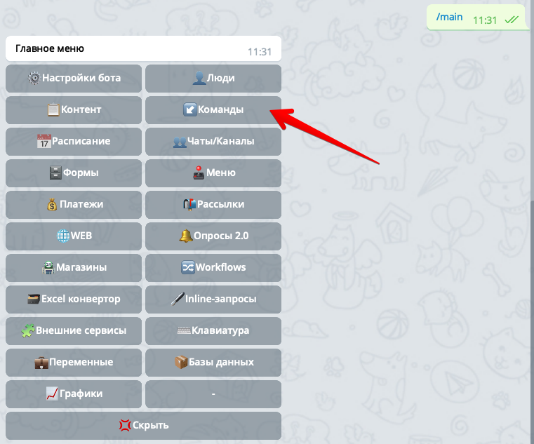
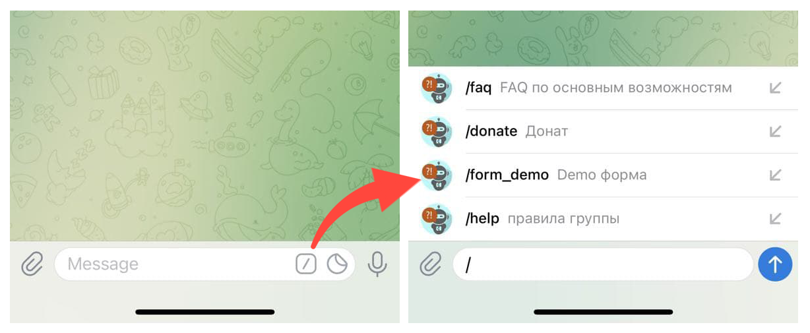
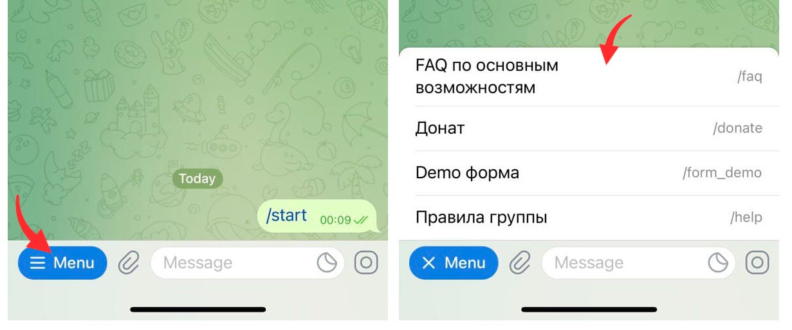
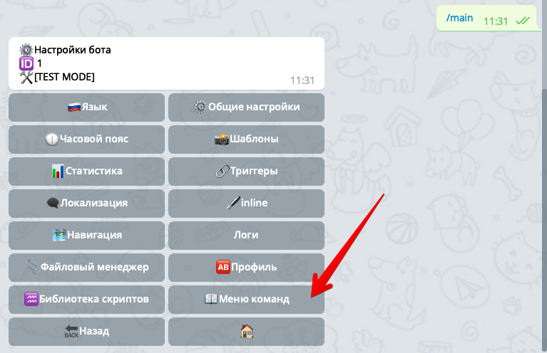

## QNext создание  Меню команд
* [Что такое команда в Telegram?](#что-такое-команда-в-telegram?)
* [Что такое команда в qnext?](#что-такое-команда-в-qnext?)
* [Что такое Меню команд в Telegram?](#что-такое-меню-команд-в-telegram?)
* [Создание Меню команд в qnext](#создание-меню-команд-в-qnext)
* [Алгоритм определения Области видимости](#алгоритм-определения-области-видимости)
* [Ограничения команд](#ограничения-команд)
* [Поиск ошибок](#поиск-ошибок)
### Что такое команда в Telegram?

Команда это текст который начинается с символа /, например `/menu`. Если такая команда встречается в тексте, на неё можно нажать и ваш бот получит сигнал о том, что пользователь выбрал какую то команду. Чтобы воспользоваться командой, пользователь может:
* Набрать текст команды вручную
* Нажать на команду в тексте переписки, если есть
* Выбрать в Меню команд Telegram, об этом [ниже](#что-такое-меню-команд-в-telegram?)

⚠️Обратите внимание, что наличие команды, такой как `/start` или `/menu`, не означает что ваш бот должен как то отреагировать на эти команды. После создания команды в Telegram, вам необходимо в своем боте указать какие действия бот выполнить в ответ на использование команды. Делается это с помощью [команд qnext](#что-такое-команда-в-qnext?).
### Что такое команда в qnext?

Команды в qnext - это по сути своей описание, как необходимо отреагировать на команду Telegram. Т.е. вы создаете в qnext команду, у каждой команды есть свой триггер, в триггере вы указываете список реакций, которые необходимо выполнить при выполнении команды. Например можно в ответ пользователю прислать какой-то текст, контент с опросом или предложить заполнить форму. Создаются команды qnext в соответствующем разделе меню:

Обратите внимание, в qnext под командой понимается не только то, что начинается на косую черту `/my_command`. В qnext командой может быть и любой текст(регулярное выражение), на который бот должен как то отреагировать. Если вы хотите чтобы на команду можно было нажать в тексте, и эту команду можно было выбрать в [**Меню команд Telegram**](#что-такое-меню-команд-в-telegram?), необходимо создать Telegram команду, начинающуюся на символ /.

### Что такое Меню команд в Telegram?

Под меню команд в Telegram подразумевается меню, которое открывается на стороне клиента при выборе кнопки `"/"`:

В обновлении Telegram [от 25 июня 2021](https://core.telegram.org/bots/api#june-25-2021) это меню сильно изменилось, и в привате с ботом оно открывается с помощью кнопки с текстом `Меню` в левом нижнем углу:

Это меню команд позволяет быстро найти и выбрать нужную команду.

Также в новой редакции Telegram bot api позволяет настроить вашего бота так, чтобы список команд был разным в различных ситуациях:
* например в привате с ботом можно сделать один набор команд, а в какой-нибудь группе - другой.
* или например чтобы все администраторы чата или бота видели один список команд, а все остальные пользователи - другой.
* так же можно локализовать описания команд, т.е. сделать так чтобы пользователям с разными языками отображался список команд с описанием на их родном языке. 
* а можно это все применить сразу и получить полный контроль над списком команд...

### Создание Меню команд в qnext

Чтобы создать Меню откройте раздел

/main -> ⚙️Настройки бота -> 📖Меню команд:

В этом разделе есть два подраздела:
* [↙️Списки команд](#списки-команд)
* [🚦Области видимости](#области-видимости)
### Списки команд

В этом разделе необходимо создать списки команд, которые потом вы будете показывать при различных условиях. Нажмите кнопку ➕Создать↙️, и укажете название вашего списка. Далее необходимо создать  кнопки, которые будут отображаться пользователю в этом списке:

При создании кнопки сначала необходимо ввести Telegram-команду в формате `/my_command`, а затем необходимо ввести описание этой команды, которое будет отображаться рядом с командой в `Меню команд`.

Вы можете создать, например несколько списков с одними и теми же командами, но с разным описанием для разных языков пользователей.

После создания списков команд, переходим в раздел 🚦Области видимости.
### Области видимости

В разделе 🚦Области видимости вы указываете какие ↙️Списки команд необходимо показывать при определенных условиях. _Далее Области видимости будем сокращенно писать так 🚦ОВ._

Нажмите кнопку ➕Создать🚦 и выберите тип области видимости из предложенного списка:
* 🚦**По умолчанию** - команды применяются для всех пользователей без разбора, включая приват с ботом и группы.
* 🚦**Все приватные чаты** - команды из этой 🚦ОВ отображаются у всех пользователей в привате с ботом. Команды НЕ отображаются в группах.
* 🚦**Все групповые чаты** - команды из этой 🚦ОВ отображаются во всех групповых чатах. Команды НЕ отображаются у пользователей в привате с ботом.
* 🚦**Все админы чатов** - команды отображаются у всех администраторов всех чатов. Команды НЕ отображаются у пользователей в привате с ботом.
* 🚦**Пользователь** - команды отображаются только у одного конкретного пользователя. При создании 🚦ОВ надо указать пользователя. Команды НЕ отображаются в группах.
* 🚦**Чат** - команды отображаются только в одном конкретном групповом чате. При создании 🚦ОВ надо указать групповой чат. Команды НЕ отображаются у пользователей в привате с ботом.
* 🚦**Админы чата** - команды отображаются только у администраторов одного конкретного чата. При создании 🚦ОВ надо указать групповой чат. Команды НЕ отображаются у пользователей в привате с ботом.
* 🚦**Участник чата** - команды отображаются только у одного конкретного участника в одном конкретном чате. При создании 🚦ОВ надо указать групповой чат и пользователя. Команды НЕ отображаются у пользователей в привате с ботом.

В зависимости от выбранного типа, далее бот может предложить выбрать дополнительные параметры, например чат и/или пользователя. 

На следующем шаге необходимо указать **ISO 639-1** код языка пользователя, например _ru_ или _en_. Вы можете не указывать язык, нажав на кнопку Пропустить, в этом случае 🚦ОВ будет применяться без проверки языка пользователя. Но если же вы укажите язык, тогда эта область видимости будет применена к пользователю только в том случае, если язык пользователя совпадает с указанным вами при создании 🚦ОВ. Например, можно создать две 🚦ОВ по умолчанию для русско- и англо- говорящих пользователей, и показывать им разные списки команд с локализованным описанием. 
### Алгоритм определения Области видимости

⚠️Если вы создали множество ↙️Списков команд и соответствующих 🚦Областей видимости, в каждый момент времени пользователь в привате или в группе может видеть только 1 единственный список команд. Какой именно список команд показывать пользователю определяется следующими алгоритмами. Условия проверяются сверху вниз, т.е. сперва верхнее, если условия не совпадают, тогда проверяется следующее и так до тех пор пока не будет найдена 🚦ОВ и соответствующий ей ↙️Список команд.

**Если пользователь находится в привате с ботом:**
* 🚦Пользователь `+ язык пользователя`
* 🚦Пользователь _(без указания языка)_
* 🚦Все приватные чаты `+ язык пользователя`
* 🚦Все приватные чаты _(без указания языка)_
* 🚦По умолчанию `+ язык пользователя`
* 🚦По умолчанию _(без указания языка)_

**Если пользователь находится в групповом чате:**
* 🚦Участник чата `+ язык пользователя`
* 🚦Участник чата _(без указания языка)_
* 🚦Администратор чата `+ язык пользователя`
* 🚦Администратор чата _(без указания языка)_
* 🚦Чат `+ язык пользователя`
* 🚦Чат _(без указания языка)_
* 🚦Все админы чатов `+ язык пользователя`
* 🚦Все админы чатов _(без указания языка)_
* 🚦Все чаты `+ язык пользователя`
* 🚦Все чаты _(без указания языка)_
* 🚦По умолчанию `+ язык пользователя`
* 🚦По умолчанию _(без указания языка)_

### Ограничения команд

Telegram накладывает некоторые ограничения на создание команд:
* Команда должна начинаться с символа косой черты `«/»`
* Команда не может быть длиннее 32 символов
* Команды могут состоять из букв латинского алфавита, цифр и подчёркивания.

Несколько примеров ✅допустимых и 🚫недопустимых названий команд:

✅Доступно:
* commandmode - ОпиСаНие
* co111andmode - описание 
* command_mode - описание

🚫Недоступно:
* cOmManDNaMe - ОпИсАнИе 
* cOmManDNaMe - описание 
* Commandname - описание 
* co!!!andmode - описание
### Поиск ошибок

При установке команд, очень советую использовать логи. Там вы сможете увидеть ошибки, которые вернул вам Telegram, если вдруг вы выполнили недопустимый запрос, например если указали недопустимый язык пользователя или название команды. Иногда телеграм может кешировать список команд, поэтому если вы не видите изменения, попробуйте перезапустить вашего клиента, чтобы сбросить кеш.

  
