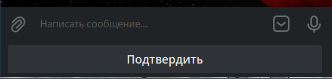

## QNext. Клавиатура

Клавиатура - это кнопки отображаемые под полем ввода текста. 

 * [**keyboardAction**](/docs-test/_export/reactions/keyboardaction) - выполнить действие при нажатии на кнопку.
 * [**keyboardHide** ](/docs-test/_export/reactions/keyboardhide)- Скрыть клавиатуру
 * [**keyboardRefresh** ](/docs-test/_export/reactions/keyboardrefresh)- Обновить текущую клавиатуру
 * [**keyboardShow** ](/docs-test/_export/reactions/keyboardshow)- Показать клавиатуру

