• [Подключаем Trello к боту](#подлючаем-trello-к-боту)
• [Настройка рабочего места](#настроика-рабочего-места-аккаунта-в-браузере) 
• [Первый update](#первыи-update-в-логах)
• [Макрос trello](/docs-test/_export/macros/trello)

Trello — облачная программа для управления проектами небольших групп.
Бот сможет просматривать доски, списки и карточки. Можно подписаться на обновления всей доски, конкретного списка или карточки. У каждой подписки есть свой триггер, который выполняется в момент когда Trello сообщает об изменениях в какой либо модели. 

## Подключаем Trello к боту

Trello — 🧰Аккаунты — ➕ Добавить — Укажите срок жизни доступа: без срока годности —  выбираем все доступы (скриншот ниже)

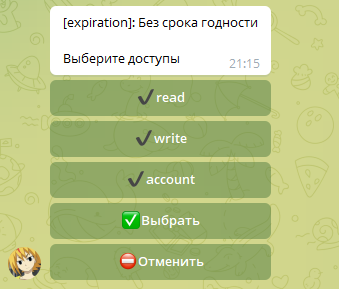

Ранее нужно создать аккаунт в Trello

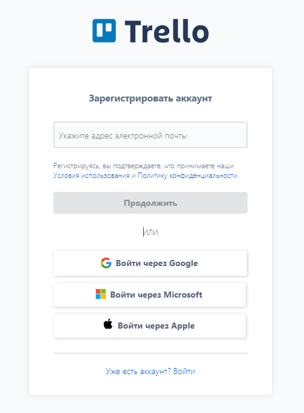

Проходим авторизацию аккаунта 🧰

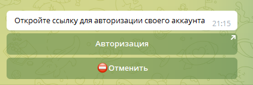

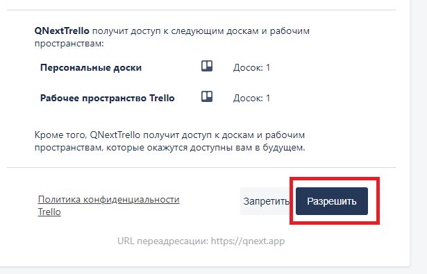

После успешной авторизации в вашем боте придёт уведомление

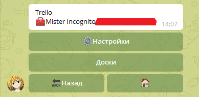

Ставим галочку для получения уведомлений в логах

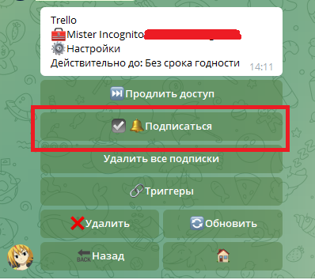
## Настройка рабочего места аккаунта в браузере                                                                                                                                                                                                                                                                                                                                                                                                                                                                                                                                                                                                                                                                                                                                                                                                                                                                                                                                                                                                                                                                                                                                                                                                                                                                                                                                                                                                                                                                                                                                                                                                                             

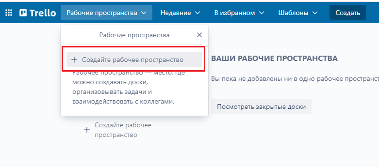

Далее ничего сложного )

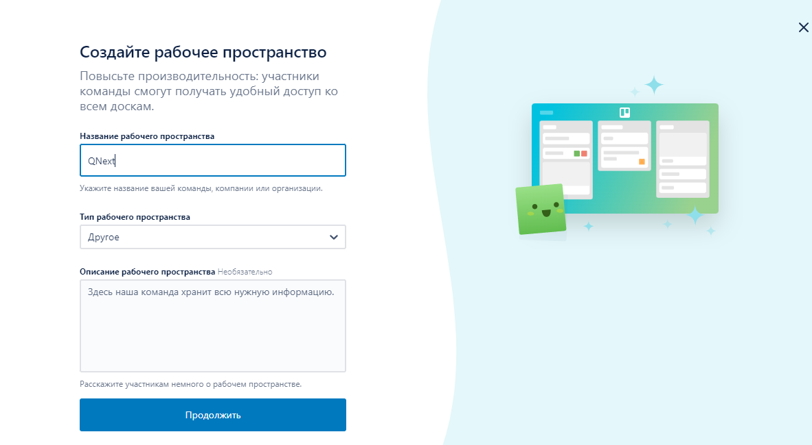

После создания рабочего места, нужно создать доску

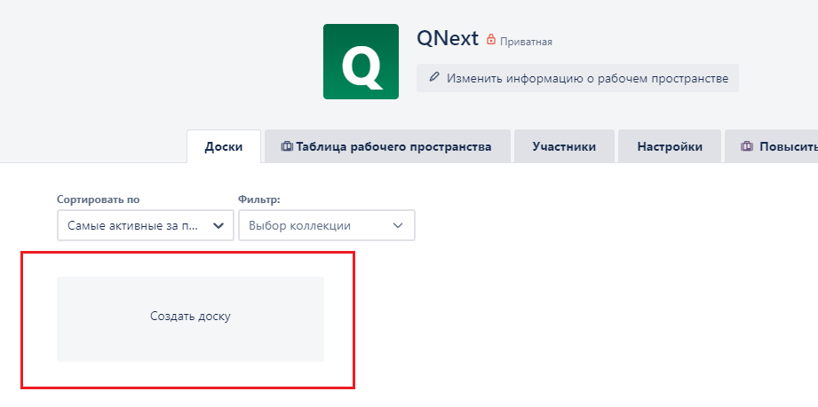

Процесс создания доски, на самой странице описано что и как. После создания доски мы получаем такой результат:

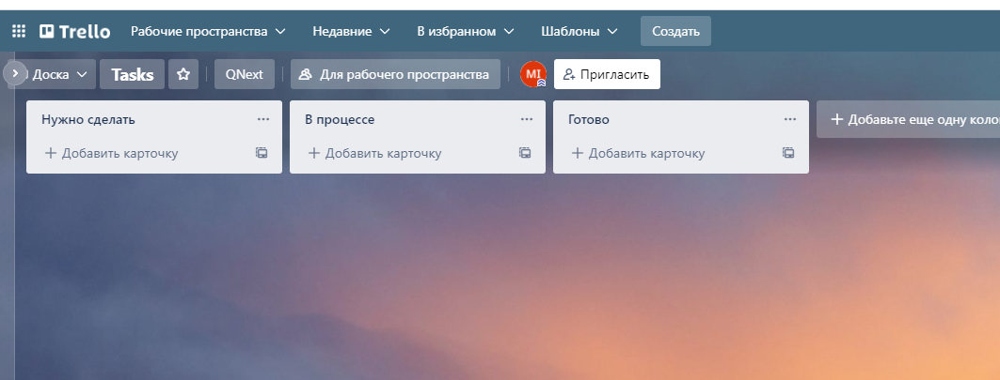
## Первый update в логах

⚙️Настройки — 🔗Триггеры — 🔗Триггер Аккаунта — ⚡️Реакции — ⚡️log

Создаем карточку на сайте Trello

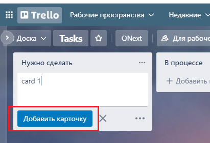

Смотрим логи 
**Что такое логи ?** [Ответ](/docs-test/_export/reactions/log) 

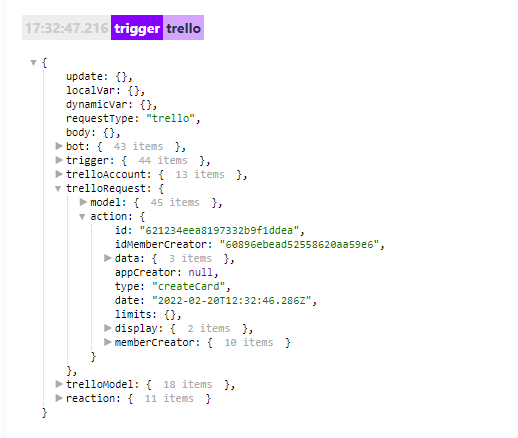
* [trelloApiRequest](/docs-test/_export/reactions/trelloapirequest)
* [trelloAddComment](/docs-test/_export/reactions/trelloaddcomment)
* [trelloCreateCard](/docs-test/_export/reactions/trellocreatecard)
* [trelloGetCard](/docs-test/_export/reactions/trellogetcard)
* [trelloGetCardAttachment](/docs-test/_export/reactions/trellocreatecardattachment)
* [trelloUpdateCard](/docs-test/_export/reactions/trelloupdatecard)

