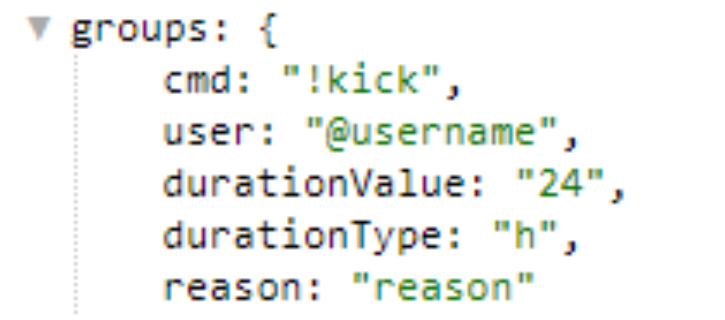
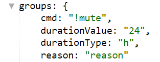

## QNext. примеры regex
### Разбор цифр на составные
* /слово (\d)(\d)?(\d)?/

**Пример:**

слово 953

**Результат:**

${exec.1} = 9

${exec.2} = 5

${exec.3} = 3

### Проверка номера телефона  +7 или 8
* /((\+7|8)(\d{10}))/

**Пример:**

текст  +71234567890   текст

текст  81234567890  текст

### Строгая проверка номера телефона +7 или 8
* /^(?:\+7|8)\d{10}$/

**Пример:**

+71234567890

81234567890

### Полная дата
* /(?<day>\d{1,2}).(?<month>\d{1,2}).(?<year>\d{4})/

**Пример:**

01.01.1970

23.10.2020

### Необязательное дополнение к команде
* /!команда(\s+((\n|.)+))?/i

**Пример:**

!команда

!команда текст

!команда текстовое подробное описание задачи для других

*все что будет идти после слова !команда можно найти в ${exec.2}

### Обрабатывание новой строки
* /Правила(\s|\|n.)+/i

**Пример:**

Правила строка 0

строка1

строка2

строка3

### Парсинг любых хештегов
* **/#\w+/**

**Пример:**

#hash

test #tag

#tag test

text #hesh text

### Проверка диапазона чисел от 9 до 99
* /^([1-9][0-9]|9)$/

**Пример:**

Примет:

10, 15, 25, 76, 88, 99.

Не пример: 

1, 5, 101, 200.

**Разделение введенного текста с помощью запятой**
* /com ([^,]+), ([^,]+), ([^,]+)$/

Пример:

/com один, два, три

Вывод:
${exec.1} = один

${exec.2} = два

${exec.3} = три

**Разбор ссылки типа t.me/ для получения username**
* /:\/\/t\.me\/(.+)/

Пример: [https://t.me/Zbots](https://t.me/Zbots)

Вывод:

${exec.1} = Zbots

Вывод текста введенного вокруг команды
* /(.+)?(!|\/)cmd(.+)?/

Пример: необязательный текст1 !cmd (или /cmd) необязательный текст2

Вывод: 

${exec.1} = необязательный текст1
${exec.3} = необязательный текст2

**Универсальная административная регулярка**
* /^(?<cmd>(!|\/)[^\s]+)\s+(?<user>[^\/\s]+)(\s+((?<durationValue>\d+)(?<durationType>d|h)))?(\s+(?<reason>[^\/]+))?$/i 

Подходит для задач когда не требуется отвечать на сообщение юзера.

Пример: !kick @username 24h reason

Вывод:

**Универсальная административная регулярка**

/^(?<cmd>(!|\/)[^\s]+)(\s+((?<durationValue>\d+)(?<durationType>d|h)))?(\s+(?<reason>[^\/]+))?$/i

Подходит для задач когда требуется отвечать на сообщение юзера.

Учебник: [Регулярные выражения](https://learn.javascript.ru/regexp-introduction)

[Qnext. Каталог полезное](/docs-test/_export/admin/lifehack)

[Qnext. Документация](/docs-test/_export)
  
[Original](https://telegra.ph/QNext-admin-useful-regex-07-04)