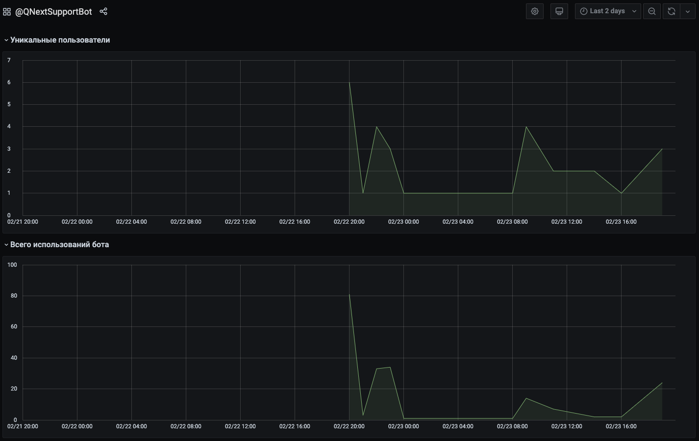
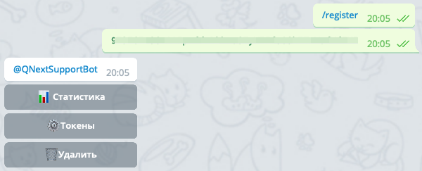

* [Что делает бот HowUsedBot](#что-делает-бот-howusedbot)
* [Где мне это может пригодится?](#где-мне-это-может-пригодится?)
* [Регистрация своего бота](#регистрация-своего-бота)
* [API](/docs-test/_export/howusedbot/api)
* [FAQ](/docs-test/_export/howusedbot/faq)

## Что делает бот HowUsedBot

[@HowUsedBot](http://t.me/HowUsedBot) - бот который поможем вам анализировать посещаемость вашего бота. Вы сможете увидеть статистику в сжатом за сегодня или вчера виде внутри бота:

Или в виде графика за любой период:

Для этого необходимо зарегистрировать своего бота и присылать обновления по API.
## Где мне это может пригодится?

Вот несколько примеров где может пригодится аналитики с помощью @HowUsedBot:
* **Общая посещаемость бота** - Делайте запрос в HowUsedBot каждый раз когда в вашем боте пользователь что-то делает, и вы сможете увидеть на графике когда, сколько и как часто юзеры использовали вашего бота.
* **Аналитика новых фичей** - Выкатили новую фичу в вашем боте? Присылайте запрос в HowUsedBot, передав в параметр **event** название новой фичи, и вы сможете увидеть на сколько она оказалась популярна.
* **Рекламные компании** - Разместили рекламную ссылку своего бота? При получении сообщений вида `"/start referral_name"` делайте запрос HowUsedBot, передав в параметре **event** то, что получено после `/start`, и вы сможете увидеть на графике на сколько эта рекламная компания оказалась удачной.
## Регистрация своего бота

Чтобы зарегистрировать своего бота, необходимо отправить боту [@HowUsedBot](http://t.me/HowUsedBot) команду `/register`, а на следующем шаге отправить боту токен вашего бота. HowUsedBot не хранит у себя ваш токен, он нужен только для того чтобы подтвердить что бот принадлежит именно вам, поэтому  после регистрации своего бота, вы можете сбросить токен вашего бота в [@BotFather](http://t.me/BotFather) командой `/revoke`.

После регистрации бот покажет меню вашего бота:

В разделе Токены вы можете получить api token, необходимый для работы с api бота. Чтобы отобразилась статистика, вы должны в своем боте при получении `update` от telegram api, делать запрос в [api @HowUsedBot](/docs-test/_export/howusedbot/api).
  
