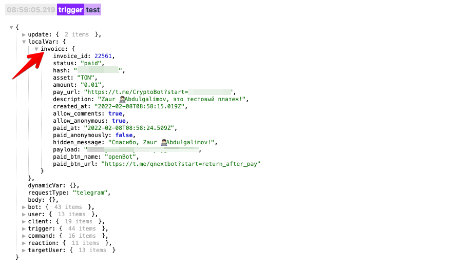

## QNext. Макрос pay

[⬅️QNext. Макросы](/docs-test/_export/macros)


Макрос !{pay} предназначен для работы с платежками, созданными в разделе
```js 
/main -> 💰Платежи
```

Макрос должен обязательно иметь два параметра:
* **type** - определяющий поведение макрос
* **methodId** - id метода способа оплаты
### type: createLink

Макрос создаст платежную ссылку:
```js 
!{pay|
  type: createLink;
  methodId: числово ID метода оплаты CryptoBot;
  amount: Количество денег;
  currency: Валюта; 
}
```


Другие типы поведения макроса могут работать по разному для разных методов оплаты, и не для всех методов оплаты доступны.
### CryptoBot

Возможные значения параметра type:
* [balance](#cryptobot-balance) - получить баланс счета
* [invoice](#cryptobot-invoice) - получить информацию о выставленном счете по его id
* [exchangeRates](#cryptobot-exchangerates) - информация о курсах валют
### CryptoBot-balance

**Все валюты:**

Макрос покажет баланс всех доступных валют:
```js 
!{pay|
  type: balance;
  methodId: числово ID метода оплаты CryptoBot;
}
```

Данный макрос выдаст следующую строку:
```js 
TON: 123
BTC: 0.001
...
```

**Все валюты в формате:**

Если вам необходимо показать определенный набор валют и в своем формате, используйте шаблон `template`:
```js 
!{pay|
  type: balance;
  methodId: числово ID метода оплаты CryptoBot;
  template: ton=%(TON), btc=%(BTC), ...;
}
```

В данном макросе используется шаблон `template`, в нем вы можете указать любой формат вывода указав необходимые валюты с помощью параметра %(NAME). Данный макрос выдаст следующую строку:
```js 
ton=123, btc=0.001, ...
```

**Вывод определенной валюты**

Если вы не хотите показывать все валюты, а вывести только одну конкретную, воспользуйтесь параметром `currency`:
```js 
!{pay|
  type: balance;
  methodId: числово ID метода оплаты CryptoBot;
  currency: TON
}
```

Данный макрос выдаст числом количество монет валюты TON:
```js 
123
```


### CryptoBot-invoice

Макрос вернет объект с информацией о выставленном счете:
```js 
!{pay|
  type: invoice;
  methodId: числово ID метода оплаты CryptoBot;
  invoiceId: ID счета выставленного в CryptoBot;
}
```

Вы можете с помощью реакции ⚡️localVarSet создать локальную переменную `invoice` с типом Объект и указать в качестве значения данный макрос. После выполнения в получите объект с информацией о счете:


### CryptoBot-exchangeRates

Макрос вернет информацию по курсам валют. Следующий макрос вернет стоимость 1 TON в долларах:
```js 
!{pay|
  type: exchangeRates;
  methodId: числово ID метода оплаты CryptoBot;
  source: TON;
  target: USD;
}
```

Если не указать параметр **target**, тогда макрос вернет объект с ценами всех доступных валют:
```js 
!{pay|
  type: exchangeRates;
  methodId: числово ID метода оплаты CryptoBot;
  source: TON;
}
```


[⬅️QNext. Макросы](/docs-test/_export/macros)


  
