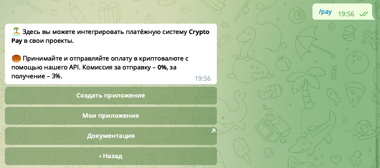
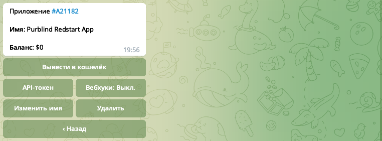
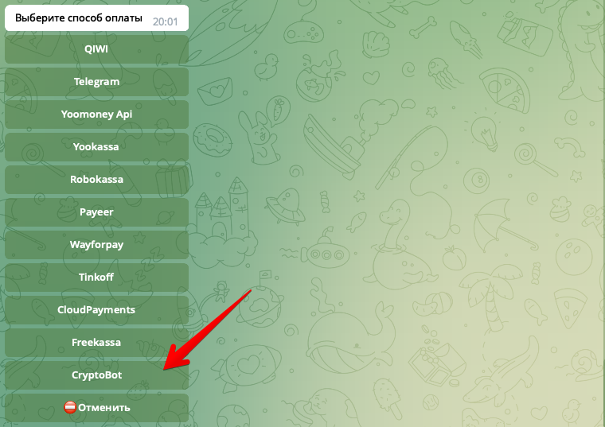
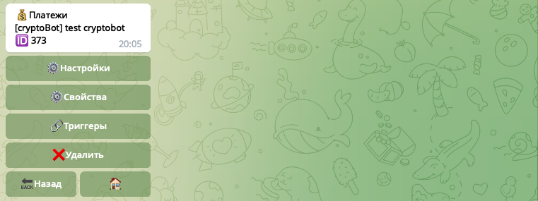
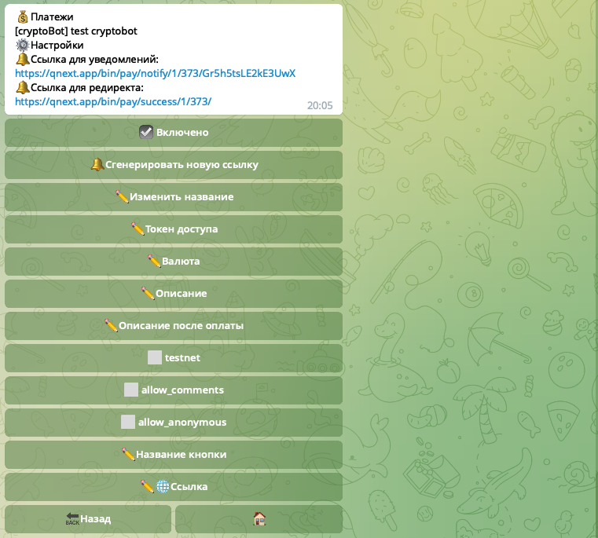
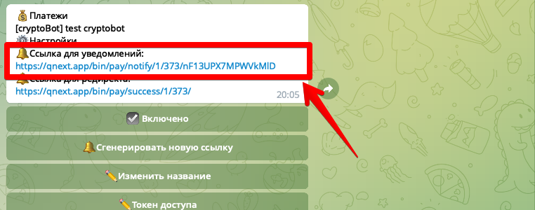
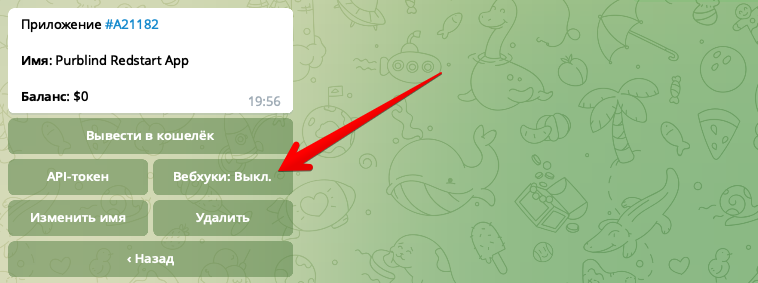

## QNext. Прием платежей с помощью CryptoBot
* [Создание приложения в CryptoBot](#создание-приложения-в-cryptobot)
* [Подключение к qnext](#подключение-к-qnext)
    * [Настройки](#настроики)
    * [Доступная валюта](#доступная-валюта)
    * [Настройка webhook](#настроика-webhook)
* [Видео](#видео)
* [Макрос pay](#макрос-pay)


### Создание приложения в CryptoBot

Для начала приема платежей необходимо создать приложение в боте [@CryptoBot](https://t.me/CryptoBot). Для этого запустите этого бота и отправьте ему команду /pay:



Нажмите кнопку **Создать приложение**, автоматически будет создано новое приложение:



Откройте раздел **API-token** и скопируйте полученный токен, он нам пригодится при создании подключения в [QNext](https://t.me/qnextbot).


### Подключение к qnext

Откройте раздел:
```js 
/main -> 💰Платежи -> Способы оплаты
```

И нажмите кнопку ➕Добавить, чтобы создать новый способ оплаты. В появившемся списке способов оплаты, выберите **CryptoBot**:



После выбора бот попросит написать название платежа, здесь можно написать любой текст, это просто название чтобы легче было найти в списке.

Следующим шагом необходимо прислать API-token который вы получили при создании приложения в @CryptoBot.

После создания способа оплаты, нажмите на него чтобы открыть раздел:


### Настройки

Откройте раздел ⚙️Настройки:



Здесь вы можете изменить название, токен и другие опции которые предоставляет @CryptoBot:
* ☑️Включено - галочка чтобы включения и выключения этого способа оплаты
* 🔔Сгенерировать новую ссылку - вы можете создать новую webhook-ссылку, если текущая будет скомпрометирована
* ✏️Изменить название - поменять название вашего метода оплаты
* ✏️Токен доступа - токен получаемый в боте CryptoBot
* ✏️Описание - текст который увидит пользователь при оплате в CryptoBot
* ✏️Описание после оплаты - текст который увидит пользователь после успешной оплаты в CryptoBot
* ☑️testnet - тестовая сеть, выберите галочку если вы создавали приложение в боте [@CryptoTestnetBot](http://t.me/CryptoTestnetBot).
* ☑️allow_comments - Разрешить пользователю оставлять комментарии при оплате в CryptoBot.
* ☑️allow_anonymous - Разрешить пользователю включить анонимную оплату
* ✏️Название кнопки - выберите какую кнопку показать пользователю после оплаты в CryptoBot
* ✏️Ссылка - эта ссылка будет на кнопке после оплаты

Все имеющиеся опции являются не обязательными, кроме токен доступа и валюты.
### Доступная валюта

Метод оплаты может работать только со следующими типами валют:
* TON
* BTC
* USDT
* USDC
* BUSD


### Настройка webhook

Чтобы платформа qnext получала информацию о совершенных платежах, вам необходимо в настройках вашего приложения в @CryptoBot указать webhook ссылку. Для этого скопируйте ссылку которую вам показывает платформа qnext в блоке 🔔Ссылка для уведомлений:



И вставьте эту ссылку в настройках приложения @CryptoBot:


### Видео
<iframe width="100%" height="400" allowfullscreen="true" src="http://www.youtube.com/embed/IR7agJgoVKU"></iframe>


### Макрос pay

Вместе с методом оплаты CryptoBot так же доступен макрос `!{pay}`, который умеет показывать баланс и invoice-счет, выставленный в боте. Подробности в [документации](/docs-test/_export/macros/pay) про макросы. 


[⬅️QNext. Платежи](/docs-test/_export/pay)


  
[Original](https://telegra.ph/QNext-Payments-CryptoBot-02-07)