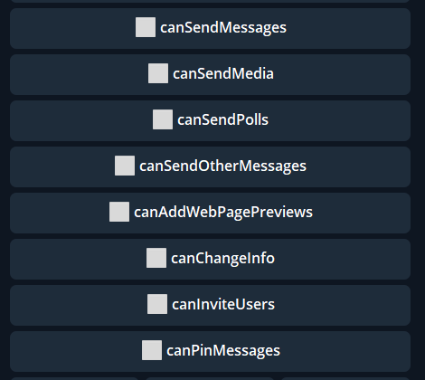

## QNext. реакция chatPermissions

**chatPermissions** — Реакция для управления разрешениями чата.

**canSendMessages** — разрешение отправлять в чат сообщения

**canSendMedia** — разрешение отправлять в чат медиа (аудио, изображения, видео)

**canSendPolls** — разрешение создавать и публиковать в чате опросы

**canSendOtherMessages** — разрешение отправлять стикеры и GIF

**canAddWebPagePreviews** — разрешение отображать превью отправляемых ссылок

**canChangeInfo** — разрешение менять профиль группы

**canInviteUsers** — разрешение добавлять новых пользователей в группу

**canPinMessage** — разрешение закреплять сообщения в чате

[QNext. Чаты](/docs-test/_export/admin/chat-about)

[QNext. Перечень реакции](/docs-test/_export/reactions)
  
[Original](https://telegra.ph/QNext-admin-reaction-chatPermissions-05-03)