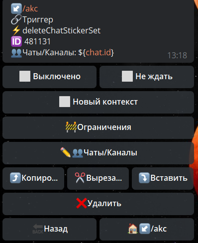

## QNext реакция deleteChatStickerSet

**deleteChatStickerSet** - удалить стикерпак группы



Чаты/Каналы - указываем чат в котором необходимо выполнить действие


```plain
[**deleteChatStickerSet  method bot.api**](https://core.telegram.org/bots/api#deletechatstickerset)
```


[QNext. Чаты](/docs-test/_export/admin/chat-about)

