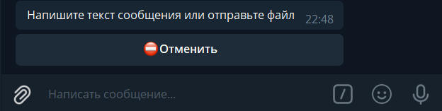

## QNext. реакция feedback

реакция feedback позволит пользователю написать сообщение администрации бота. Администраторы получат уведомление о том, что пользователь написал сообщение. Все сообщения можно будет увидеть в разделе 👥Пользователи главного меню.

Особенности: 

Если администратор попытается ответить пользователю, когда тот уже получил ответ от другого администратора, или в момент, когда другой администратор набирает текст ответа, он будет оповещён об этом.

Реакция отзыва может содержать текст и файл.

