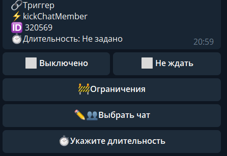

## QNext. реакция kickChatMember

**banChatMember -** Исключает* пользователя из чата. по умолчанию время выставлено = 0 (бесконечно, перезайти сразу нельзя)

Особенности:
* Нельзя применить по отношению к создателю бота и к самому боту
* в bot.api нет термина "исключить", этот термин чисто пользовательский, бот может только забанить пользователя (аналогично, если удалить человека из меню Управление группой), таким образом, дабы пользователя именно Исключить, а не забанить, необходимо использовать различные варианты:

— kickChatMember + установить время 1 минуту.

— kickChatMember + unbanChatMember

— kickChatMember + restrictChatMember

[QNext. Чаты](/docs-test/_export/admin/chat-about)

