## QNext. реакция log

**log** - сохранение в логах совершенного действия (или группы действий).

Запуск логов производится через: Настройки бота - логи.

[**Открыть страницу с логами**](#открыть-страницу-с-логами)

[**Обзор**](#вид)

[**Запуск**](#как же их увидеть (вызвать)?)

[**Подробный разбор**](#разберем-подробнее)

— [**Постоянные параметры**](#постоянные-параметры)

— [**Динамические параметры**](#динамические-(зависимые)-параметры)
### Открыть страницу с логами

Страница с логами доступна по адресу [qnext.app/logs](https://qnext.app/logs). Прежде чем открыть страницу с логами, необходимо один раз пройти авторизацию в том браузере, в котором вы хотите смотреть логи. Чтобы пройти авторизацию, необходимо в разделе:
```js 
/main -> web -> ☂️Web-авторизация
```

нажать на кнопку-ссылку **Авторизоваться**. ⚠️Здесь важно именно нажать на кнопку, а не копировать ссылку. Телеграм спросит разрешить ли предоставлени информации боту. Подтвердите это действие и у вас откроется страница с информацией о том что авторизация пройдена. После подтверждения сайту будут доступна информация из вашего профиля: имя, username, id и ссылка на фото профиля. Подробнее о процедуре телеграм-авторизации можно почитать в [документации telegram](https://core.telegram.org/widgets/login).

После этого логи вашего бота вам всегда будут доступны по адресу [qnext.app/logs](https://qnext.app/logs). Любой администратор вашего бота, авторизованный аналогичным способом, так же сможет видеть логи вашего бота.

Если вы являетесь администратором нескольких ботов, вам достаточно один раз пройти авторизацию в любом боте, после этого смотреть логи любого из этих ботов можно по ссылке `qnext.app/logs/@BotUsername`.
### Вид

Как выглядят логи:

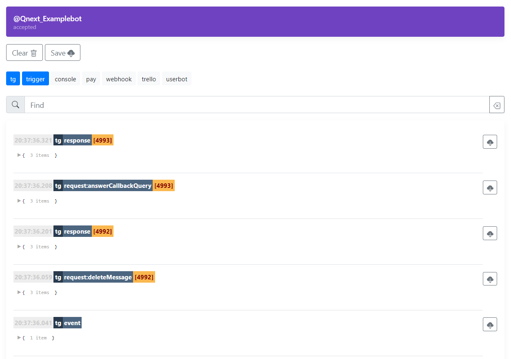

**tg** - все события совершаемые ботом, или которые видит бот.

**trigger** - это наша реакция log.

**console** - 

**pay** - платежные системы

**webhook** - вебхук 

**trello** - сервис трелло

**userbot** - (в разработке)


### Как же их увидеть (вызвать)? 

Вставляем реакцию Log в желаемом разделе (или после желаемой реакции)

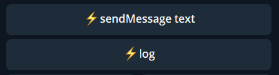

И инициируем запуск реакций! Готово!


Как выглядит реакция log по молчанию.

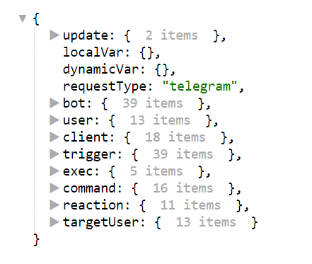


### Разберем подробнее
### Постоянные параметры
### update

Раздел отображает все исходные (сырые, необработанные) данные предоставленные Телеграмом:

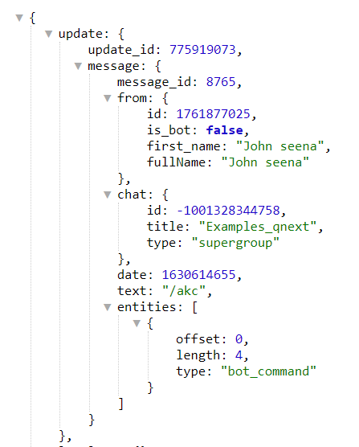
* Кто совершил действие - _${update.message.from...}_
— _${update.message.from.fullName}_ = John seena

* Где совершено действие - _${update.message.chat...}_
— _${update.message.chat.title}_ = Examples_qnext

* Время (в формате timestamp) - _${update.message.date}_
— _${update.message.date}_ = 1630614655

* Отправленный текст - _${update.message.text}_
— _${update.message.text}_ = /akc

* Вложения (медиа) - _${update.message.entities...}_
— _${update.message.entities.0.type}_ = bot_command

### localVar

Доступные локальные переменные.
### dynamicalVar

Доступные динамические переменные.
### requestType

Переменная ${requestType} покажет откуда прилетело данное событие, например от Telegram, от Платежки, от Trello и т.п. Для переменной возможны следующие значения:

🔸 telegram

🔸 webhook

🔸 trello

🔸 userBot

🔸 pay

🔸 newsletter

🔸 dashboard
### bot

Системный раздел, отвечающий за параметры бота. В большинстве случаев, он вам будет не нужен.
### user

показывает подробности об инициаторе действия (первое/второе имя, ID, и прочие данные)

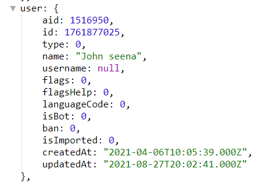

— _${user.id}_ - ID пользователя

— _${user.name}_ - имя пользователя

— _${user.username}_ - юзернейм пользователя (@username)
### client

Системный раздел, отвечающий за параметры клиента пользователя. Все сведения в этом разделе, отдает Телеграм. В большинстве случаев, он вам будет не нужен.
### trigger

Системный раздел, отвечающий за параметры запущенного триггера. В большинстве случаев, он вам будет не нужен.
### reaction

Системный раздел, отвечающий за параметры клиента пользователя. Все сведения в этом разделе, отдает Телеграм. В большинстве случаев, он вам будет не нужен.


### Динамические (зависимые)  параметры

**Логи появляются только после выполнения определенных действий.** 

!Логи могут отличаться от того, что будет в реальности, в связи с тем, что проект продолжает развиваться!
### command

Системный раздел, отвечающий за параметры запущенной команды. В большинстве случаев, он вам будет не нужен.
### takeUsers

(устаревшая форма раздела targetUsers)
### targetUser 

Раздел вызываемый реакцией takeUsers.

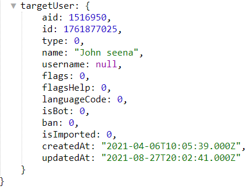

— _${targetUser.id}_ - ID пользователя

— _${targetUser.name}_ - полное имя пользователя

— _${targetUser.username}_ - юзернейм пользователя (@username}
### exec 

Раздел вызываемый с помощью регулярного выражения типа: /(.+)/i

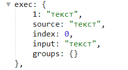

— _${exec.1}_ - содержит введенный параметр
### userAction

Раздел вызывается при запуске отложенного действия

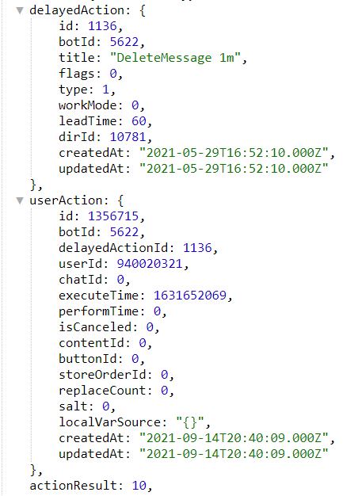


### fieldValue

Раздел доступ после прохождения поля. Отображает параметры последнего пройденного поля. Удобен, если нужно в теле вопроса формы, указать ответ в предыдущем поле.

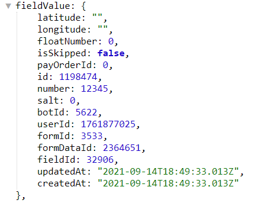

— _${filendValue.number}_ - содержит ответ/выбор пользователя в последнем пройденном поле.
### formResult 

Раздел отображается во время окончания формы в триггере финиша

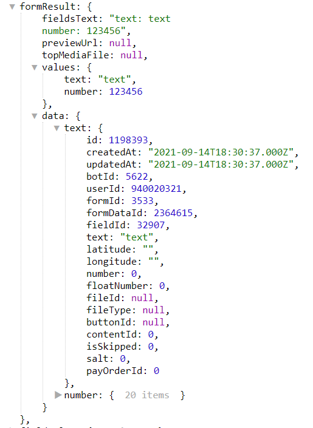


— _${formResult.fieldsText}_ - содержит все что вводил (или выбирал) пользователь

— _${formResult.values.text}_ - содержит параметр отдельного поля text

— _${formResult.values.number}_ - аналогично предыдущему, содержит значение поля number.

Подробнее можно изучить ниже:
[Видео-инструкция как работать с логами в форме](https://youtu.be/3tm1ARN_G7g)
[Текстовая инструкция как работать с логами в форме](https://t.me/QNextCases/120) 
### fieldValue

Раздел отображается в триггере подготовки поля. Здесь можно увидеть, что пользователь ввел в поле. Функция необходима для того, что б ответ пользователя в прошлом поле, отобразить в следующем (или, в необходимом вам.

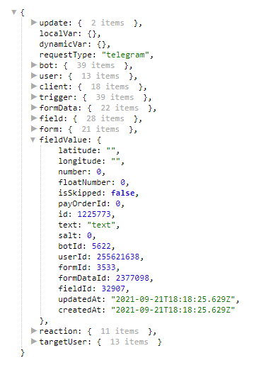

— _${fieldValue.text} - будет содержать текст (или выбор сделанный пользователем) в предыдущем поле_
### pay 

Раздел вызывается во время запуска платежа и во время успешной оплаты (или тестового платежа)
### reactionResult 

Раздел, доступный в течение одной реакции после реакций типа send... _(sendmessage, sendMenu, sendContent)_

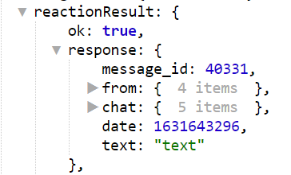

— _${reactionResult.response.message_id}_ - ID отправленного сообщения

— _${reactionResult.response.from...}_ - хранит сведения об инициаторе отправленного сообщения

— _${reactionResult.response.chat...}_ - хранит сведения о чате куда отправлено сообщение
### scriptResult 

Раздел, доступный после реакции runScript

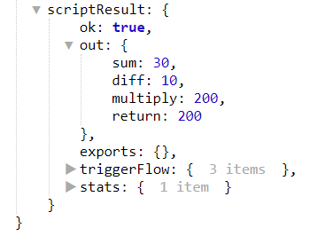

— Сумма: _${scriptResult.out.sum}_

— Разница: _${scriptResult.out.diff}_

— Произведение: _${scriptResult.out.multiply}_


### serviceMessage

— '1': 'leftChatMember',

— '2': 'newChatMembers',

— '3': 'newChatPhoto',

— '4': 'deleteChatPhoto',

— '5': 'newChatTitle',

— '6': 'pinnedMessage',

— '7': 'messageAutoDeleteTimerChanged',

— '8': 'voiceChatStarted',

— '9': 'voiceChatEnded',

— '10': 'voiceChatParticipantsInvited',

— '11': 'voiceChatScheduled'


[Видео инструкция как работать с логами](https://youtu.be/7aWbBXHSsj8)

[Видео инструкция как работать с логами в форме](https://youtu.be/3tm1ARN_G7g)

[Видео инструкция как работать с логами с использованием takeMention](https://youtu.be/pJcQ1nAWUmI)


[QNext. Перечень реакции](/docs-test/_export/reactions)


  
[Original](https://telegra.ph/QNext-admin-reaction-log-05-09)