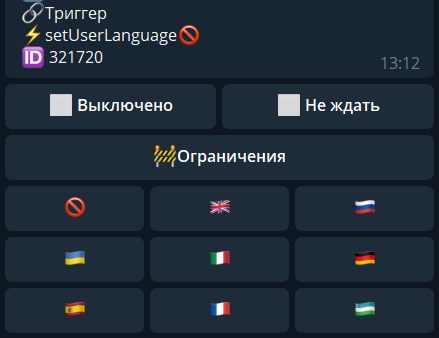

## QNext. реакция setUserLanguage

**setUserLanguage** — реакция позволяющая пользователю выбрать язык внутри бота. Все системные кнопки внутри бота будут на выбранном языке.

 — По умолчанию язык не выбран, используется тот, что выбран создателем в настройках бота.

 — Для определения, какой язык выставлен у пользователя, используется ограничение: 🚧userLanguage

