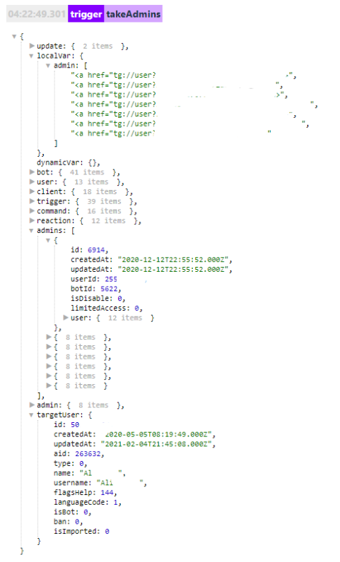

## QNext. реакция takeAdmins

takeAdmins - взять админов бота.

Пример использования:
* нам нужно отправить результат формы всем админам.

takeAdmins

— formResult
* Нужно оповестить админов о том, что кто-то запустил бота.

takeAdmins

— message: ${user} запустил бота.

Получить список админов:

takeAdmins

— localVarAdd тип список, admin = !{user | path: targetUser}

—  log

Локальная переменная с полным списком: ${localVar.admin}

список админов будет доступен в разделе ${admins...}

К примеру если нужно указать первого админа из списка, необходимо использовать переменную: 

${admin.0.user.name} - укажет полное имя админа

${admin.0.user.name} - укажет его ID

Для получения остальных админов меняем 0 на 1 и далее, 2,3,4.

