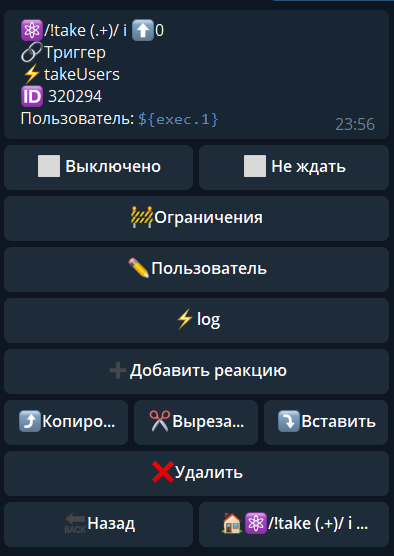
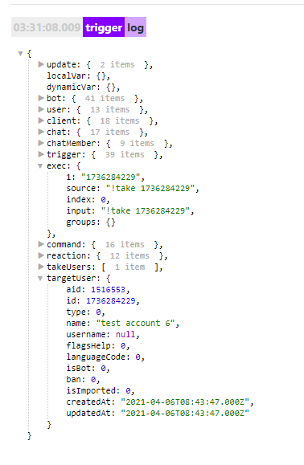

## QNext. реакция takeUsers

**takeUsers** - взять пользователя(ей) для дальнейшей работы. 

Пример использования:

Команда: /!take (.+)/i

Реакции:

— takeUsers (exec.1}

— — log

В логах мы увидим следующее:

а именно: 
* ID — пользователя
* name — (полное имя) пользователя
* username — (или отсутствие)
* isBot — проверка бот это или пользователь. 0 = пользователь, 1 = бот.
* ban — забанен пользователь в боте или нет. 0 = не забанен, 1 = забанен.

Если необходимо исключить пользователя из чата, нам потребуется:

Команда: /!take (.+)/i

Реакции:

— takeUsers (exec.1}
— — takeChat 
— — — kickChatMember

**Особенности:**
* Работает только юзернеймами (@username) и ID (123456789)
* Не работает c меншенами (Sergey - ссылка на пользователя без юзернейма)

Если необходимо использовать @username и меншены, подойдет:

 [реакция:  **takeMentions**](/docs-test/_export/reactions/takementions)

