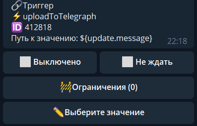

## QNext. реакция uploadToTelegraph

**uploadToTelegraph** - Реакция загрузит фото/видео в telegra.ph и вернет ссылку на этот файл. 

Важно:
— Реакция работает только с фото и видео
— Файлы можно загружать как и с сжатием, так и без сжатия (если нужно сохранить формат файла)
— Ограничения Телеграфа очень строгие - 5мб на файл

В значение необходимо указать откуда брать файл:

— если нужно загрузить медиа из отправленного сообщения*:  
_${update.message}_

— если нужно загрузить медиа из чужого сообщения**: _${update.message.reply_to_message}_

Пока что, реакция не работает с альбомами, в связи с чем:
*Если загрузить альбом - загрузится последнее фото.
**Если ответить на альбом - загрузится первое фото.

А можно указать путь до объект который хранит в себе параметры fileId и type. Поле type может иметь должно из значений:

🔸photo

🔸video

По умолчанию, реакция берет самый большой из доступных размеров и его загружает. Если вам нужен меньший размер, то необходимо создать объект с этими данными в формате file_id и type, пример ниже:

Собираем объект:

1) localVarSet file.fileId = _${путь до file_id}_ **Галочка Собрать объект**

2) localVarSet file.type = _photo_ **Галочка Собрать объект**

а потом указываем путь:

_${localVar.file}_

