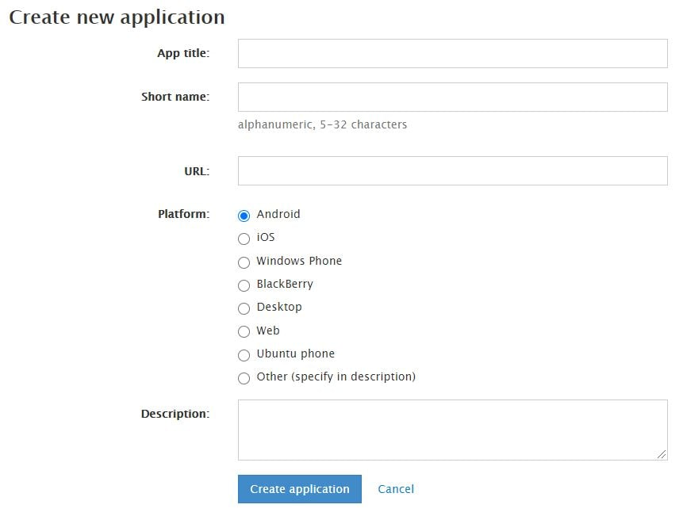
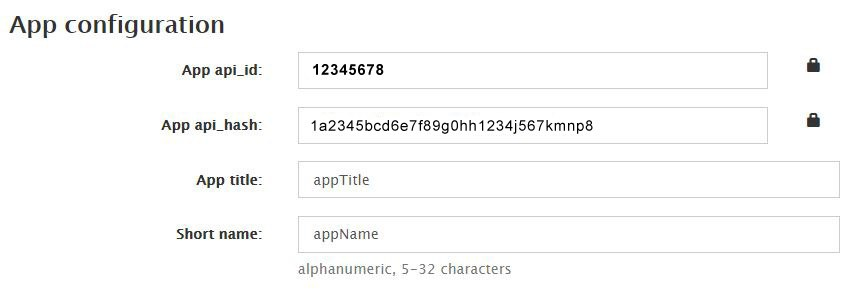

Регистрация и подключение юзербота.

## Регистрация

1. заходим по [ссылке](https://my.telegram.org/auth)

2. авторизуемся

3. выбираем: **API development tools**

4. нас просят заполнить форму из нескольких полей

 
 
app title: любой текст на английском

short title: любой текст на английском

link: любая ссылка (например google.com)

Platform: платформа для разработки (я выбираю линукс, винду, андроид)

Descroption: пропускаю вообще. 

5. нажимаем **Create application**

6. страница обновляется, видим:

 
 
**App configuration**

App api_id: короткий (символов 10) текст

App api_hash: длинный (символов 35-40) текст

__Этот текст мы копируем себе в избранное, блокнотик, файлик, любое место где удобно хранить.__

## Подключение

1. заходим в бота - внешние сервисы - userBot - создать

2. вводим любое название (тех. название для себя)

3. вводим скопированные в 5 пункте: api_id

4. вводим скопированные в 5 пункте api_hash

5. вводим номер аккаунта в формате:
код оператора и номер (пример: +79656913197)

6. получаем окно "авторизация юзербота". Ждем секунд 20-30, и жмем "обновить.

7. нажимаем телефон и заново вводим номер телефона

8. вводим код авторизации (придет в личку этому аккаунту от Telegram)

9. __опционально__: вводим 2фа пароль

10. получаем окно:
```plain 
название юзербота
ID юзербота
триггеры
удалить / обновить
```

Нажимаем "обновить"

получаем: ✅UserBot аккаунт активен

Готово