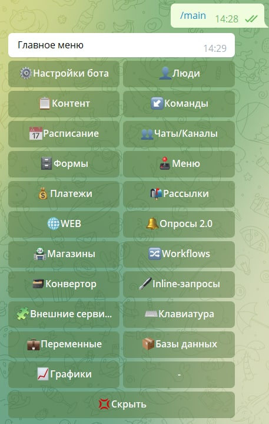

# Меню администратора

Меню администратора - это главное меню управления вашим ботом. В этом меню вы можете настраивать своего бота, создавать различные меню, клавиатуры, опросы, расписания и многое другое.

Чтобы открыть Меню администратора, необходимо в вашем боте набрать команду `/main`. 

## Меню администратора

[QNext. Настройки бота](/docs/admin/setting)

[QNext. Люди](/docs/admin/people)

[QNext. Контент](/docs/admin/content)

[QNext. Команды](/docs/admin/command)

[QNext. Расписание](/docs/admin/schedule)

[QNext. Чаты/Каналы](/docs/admin/chats-and-channels)

[QNext. Формы](/docs/admin/forms)

[QNext. Меню](/docs/admin/menu)

[QNext. Платежи](/docs/admin/pay)

[QNext. Рассылки](/docs/admin/newsletters)

[QNext. WEB](/docs/admin/web)

[QNext. Магазины](/docs/admin/stores) 

[QNext. WorkFlows](/docs/admin/workflow) 

[QNext. Конвертор](/docs/admin/converter) 

[QNext. Внешние сервисы](/docs/admin/external-services)

[QNext. Клавиатура](/docs/admin/keyboard)

[QNext. Переменные](/docs/admin/variables)