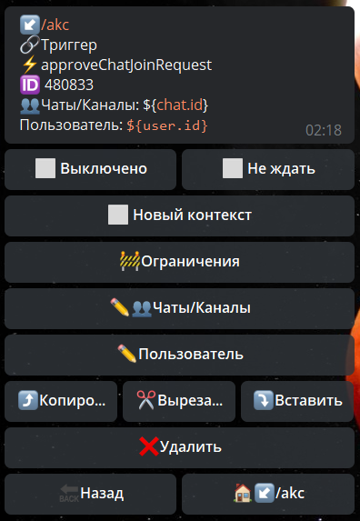

# approveChatJoinRequest

**approveChatJoinRequest** - одобрить запрос в чат.

| Функция | Описание |
| --- | --- |
| Чаты/Каналы | указываем в каком чате необходимо одобрить заявку пользователя |
|Пользователь | указываем ID юзера, чью заявку необходимо одобрить. |

::: tip Особенности️
**[bot.api method - approveChatJoinRequest](https://core.telegram.org/bots/api#approvechatjoinrequest)**
:::

