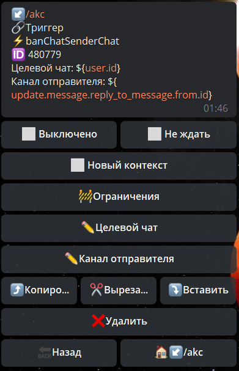

# banChatSenderChat

**banChatSenderChat** - заблокировать канал в чате.

Целевой чат - путь в котором будет указан id чата где надо заблокировать канал

Канал отправителя - путь по которому указан ID канала

[bot.api method - banchatsenderchat](https://core.telegram.org/bots/api#banchatsenderchat)

