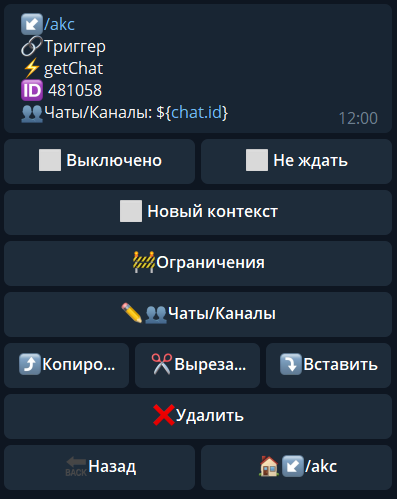
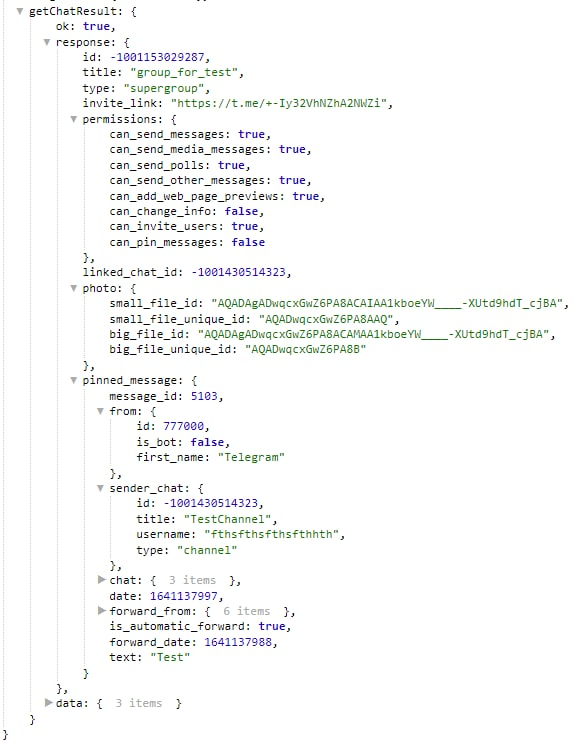

# getChat

**getChat** - получить информацию о чате. 



Чаты/Каналы - указываем чат в котором необходимо выполнить действие

Информация о чате будет доступна в переменной:
```${getChatResult}```




::: tip Особенности️
**[bot.api method - getChat](https://core.telegram.org/bots/api#getchat)**
:::


