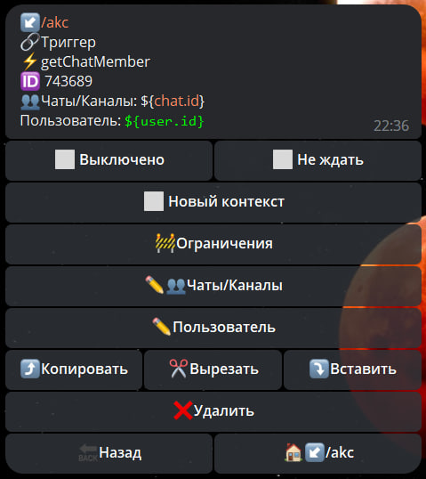

# getChatMember

**getChatMember** - получить информацию о пользователе, который контактировал с ботом.



| Функция | Описание |
| --- | --- |
| Чаты/Каналы | указываем чат в котором необходимо выполнить действие. |
| Пользователь | указываем путь, по которому можно найти ID пользователя. |

Информация о пользователе будет доступна в переменной:

```${getchatMemberResult}```

| Статус | Описание |
| --- | --- |
| [Left](./#left) | Не был в чате |
| [Member](./#member) | Участник чата |
| [Restricted](./#restricted) | Ограниченный участник чата |
| [Administrator](./#administrator) | Администратор чата |
| [Creator](./#creator) | Создатель (владелец) чата |
| [Kicked](./#kicked) | Исключен (забанен) из чата |


### left

Если пользователь никогда не был в чате, то будет status = `left`

```json
"getChatMemberResult": {
--"ok": true,
  "response": {
----"user": {
------"id": 123456789,
      "is_bot": false,
      "first_name": "name",
      "username": "name",
      "language_code": "ru"
    },
    "status": "left"
  }
```
---

### member

Если пользователь является участником чата, то будет status = `member`

```json
    "getChatMemberResult": {
      "ok": true,
      "response": {
        "user": {
          "id": 123456789,
          "is_bot": false,
          "first_name": "name",
          "last_name": "name",
          "username": "name",
          "is_premium": true
        },
        "status": "member"
      }
```
---

### restricted

Если пользователь является ограниченным участником чата, то будет status = `restricted`

```json
    "getChatMemberResult": {
      "ok": true,
      "response": {
        "user": {
          "id": 123456789,
          "is_bot": false,
          "first_name": "name",
          "last_name": "name",
          "username": "username",
          "language_code": "ru"
        },
        "status": "restricted",
        "until_date": 0,
        "can_send_messages": true,
        "can_send_media_messages": true,
        "can_send_audios": true,
        "can_send_documents": true,
        "can_send_photos": true,
        "can_send_videos": true,
        "can_send_video_notes": true,
        "can_send_voice_notes": true,
        "can_send_polls": true,
        "can_send_other_messages": true,
        "can_add_web_page_previews": true,
        "can_change_info": false,
        "can_invite_users": false,
        "can_pin_messages": false,
        "can_manage_topics": false,
        "is_member": true
      }
```
---

### administrator

Если пользователь является администратором чата, то будет status = `administrator`

```json
    "getChatMemberResult": {
      "ok": true,
      "response": {
        "user": {
          "id": 123456789,
          "is_bot": false,
          "first_name": "name",
          "username": "username",
          "language_code": "ru"
        },
        "status": "administrator",
        "can_be_edited": false,
        "can_manage_chat": true,
        "can_change_info": true,
        "can_delete_messages": true,
        "can_invite_users": true,
        "can_restrict_members": true,
        "can_pin_messages": true,
        "can_manage_topics": false,
        "can_promote_members": true,
        "can_manage_video_chats": true,
        "is_anonymous": false,
        "can_manage_voice_chats": true
      }
```
---

### creator

Если пользователь является создавателем (владельцем) чата, то будет status = `creator`

```json
    "getChatMemberResult": {
      "ok": true,
      "response": {
        "user": {
          "id": 123456789,
          "is_bot": false,
          "first_name": "name",
          "last_name": "name",
          "username": "username",
          "language_code": "ru",
          "is_premium": true
        },
        "status": "creator",
        "is_anonymous": false
      }
```
---

### kicked

Если пользователь ранее был в чате, но был исключен или забанен, то будет status = `kicked`

```json
    "getChatMemberResult": {
      "ok": true,
      "response": {
        "user": {
          "id": 123456789,
          "is_bot": false,
          "first_name": "name",
          "username": "username"
        },
        "status": "kicked",
        "until_date": 0
      }
```


::: tip Особенности️
**[bot.api method - getChatMember](https://core.telegram.org/bots/api#getchatmember)**
:::
