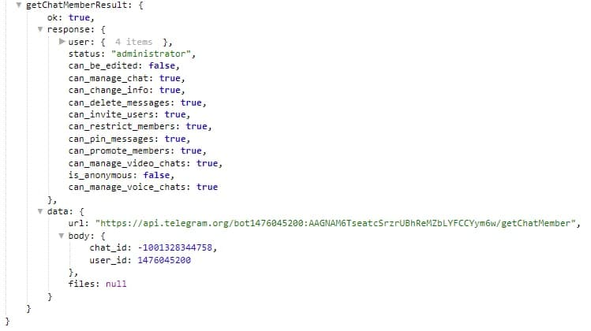

# getChatMember

**getChatMember** - получить информацию об участнике чата


| Функция | Описание |
| --- | --- |
| Чаты/Каналы | указываем чат в котором необходимо выполнить действие. |
| Пользователь | указываем путь, по которому можно найти ID пользователя. |

Информация будет доступна в переменной:

```${getchatMemberResult}```

Если бот имеет статус "участник = member"


Если бот имеет статус "админ = administator"



::: tip Особенности️
**[bot.api method - getChatMember](https://core.telegram.org/bots/api#getchatmember)**
:::


