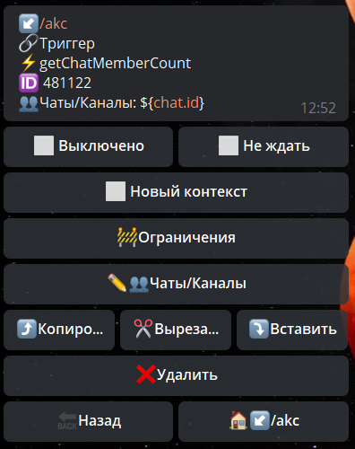

# getChatMemberCount

**getChatMemberCount** - получить количество участников в чате.



Чаты/Каналы - указываем чат в котором необходимо получить информацию.

Информация доступна в переменной: 
```${chatMembersCountResult}```

```json
"chatMembersCountResult": {
      "ok": true,
      "response": 59,
     }
```

::: tip Особенности️
**[bot.api method - getChatMemberCount](https://core.telegram.org/bots/api#getchatmember)**
:::


