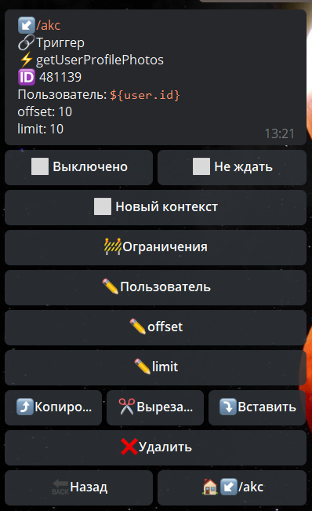
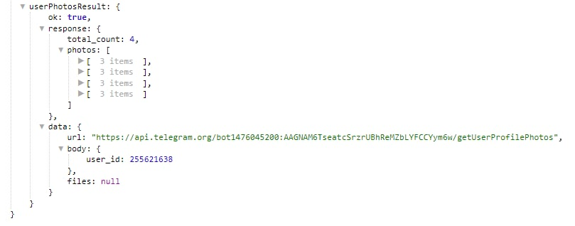

# getUserProfilePhotos

getUserProfilePhotos - получить аватарку(ки) пользователя



Пользователь - указываем ID пользователя, чьи аватарки надо загрузить.

offset - порядковый номер первой загружаемой фотографии

limit - количество загружаемых аватарой

Информация будет доступна в переменной:

```${userPhotosResult}```



**Особенности**:

Можно загрузить не более 100 аватарок за 1 запрос
️
[**bot.api method - getUserProfilePhotos**](https://core.telegram.org/bots/api#getuserprofilephotos)


