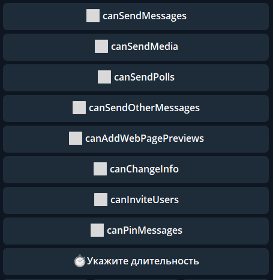

# restrictChatMember
**restrictChatMember** — реакция позволяющая ограничивать или выдавать различные разрешения пользователю в чате.

**CanSendMessages** — разрешить писать в чате

**CanSendMedia** — разрешить отправлять Медиа

**CanSendPolls** — разрешить отправлять опросы

**CanSendOtherMessage** — разрешить отправлять стикеры и гиф

**CanAddWebPagePreviews** — предпросмотр для ссылок (превью)

**CanChangeInfo** — разрешить изменять профиль группы

**CanInviteUsers** — разрешить добавлять участников

**CanPinMessages** — разрешить закреплять сообщения

◻️ - выключено (запрещено)

☑️ - включено (разрешено)

опция "Длительность", поможет указать длительность с помощью ${переменной} или !{макроса}. Например, чтобы указать время 1 сутки, воспользуйтесь следующим макросом: 

!{date| 

 type: now;

 shift: +1d;

}

::: tip  Особенности

— Разрешение **CanSendMedia** не работает самостоятельно. Что б его использовать, нужно вместе с ним выключать **CanSendOtherMessage** и **CanAddWebPagePreviews**

— По умолчанию время выдаваемых ограничений = 0 (бесконечно), для указания времени ограничения, используйте функцию "**укажите длительность**"

:::

