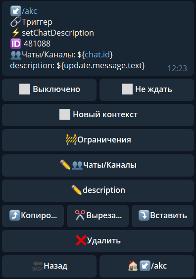

# setChatDescription

**setChatDescription** - изменить описание чата

Чаты/Каналы - указываем чат в котором необходимо выполнить действие

title - текст, на который необходимо изменить описание

**Особенности**:

Максимум 255 символов.

::: tip ℹ️
[**bot.api method - setChatDescription**](https://core.telegram.org/bots/api#setchatdescription)
:::

