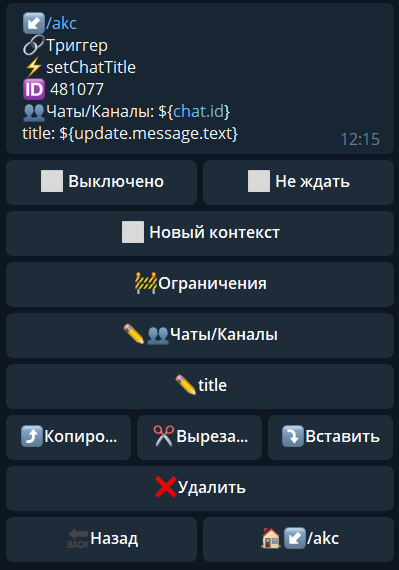

# setChatTitle
**setChatTitle** - изменить название группы

| Функция | Описание |
| --- | --- |
| Чаты/Каналы | указываем чат в котором необходимо выполнить действие. |
| title | текст, на который необходимо изменить название. |

::: tip  Особенности

Максимум 255 символов.

**[bot.api method - setChatTitle](https://core.telegram.org/bots/api#setchattitle)**

:::

