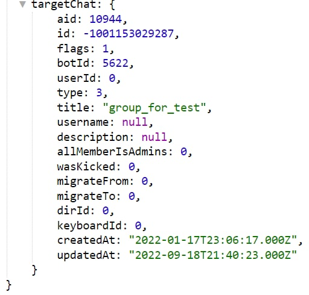

# takeChat
**takeChat** - загружает чат для дальнейшей работы с этим чатом.

| Функция | Описание |
| --- | --- |
| Целевой чат* | Чат с которым будут выполняться дальнейшие действия |
| ID топика | Если у вас в чате подключены [Темы(Топики)](/admin/topic/), то вам нужно указывать ID в виде числа или переменной топика для отправки сообщений в топики |

*Целевой чат в реакции takeChat может быть представлен только тремя вариантами:
* выбрать чат из списка;
* указать id чата или его username;
* указать локальную переменную которая содержит: id чата или его username