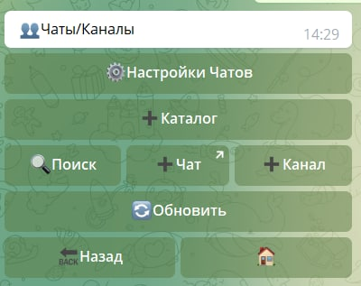
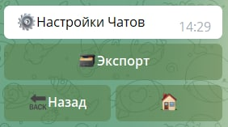
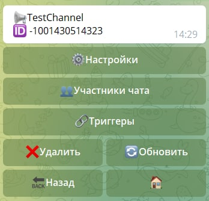
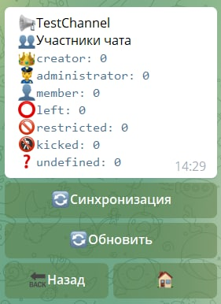
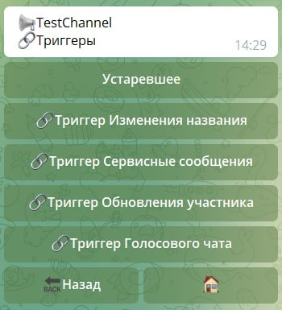

# Чаты и каналы

**Чаты и каналы** - раздел для работы с чатами и каналами, в которые был добавлен бот.

В этом раздедле будут отображены все чаты и каналы в которые был добавлен бот.

## Настройки чатов

Раздел "Настройки чатов" имеет функцию Экспорта. Вы получите эксель файл (name.xlsx)

В полученном файле будут доступны колонки:

- **ID чата/канала**
- **Username**
- **Название**
- **Тип (чат/канал)**
- **Количество участников**
- **Администраторы**

## Настройки чата/канала

Настройки конкретного чата/канала

В настройках конкретного чата/канала доступны следующие функции:

### **Настройки**: 
 
 **activeInGroup** - включает реагирование бота в чатах/каналах
 
### **Участники чата**:
 
 
 
- **creator** - владелец
- **administrator** - администратор(ы)
- **member** - участник(и)
- **left** - покинули чат
- **restricted** - ограничены 
- **kicked** - исключены (забанены)
- **undefined** - аккаунт пользователя удален
 
### **Триггеры**
 
  
  
- **Триггер Изменения названия** - отслеживает изменения названия чата/канала
- **Триггер Сервисного сообщения** - отслеживает сервисные сообщения в чате/канале
- **Триггер обновления участника** - отслеживает изменение прав участника: ограничения, назначение и снятия административных прав.
- **Триггер Голосового чата** - отслеживает все что связано с Голосовым чатом.