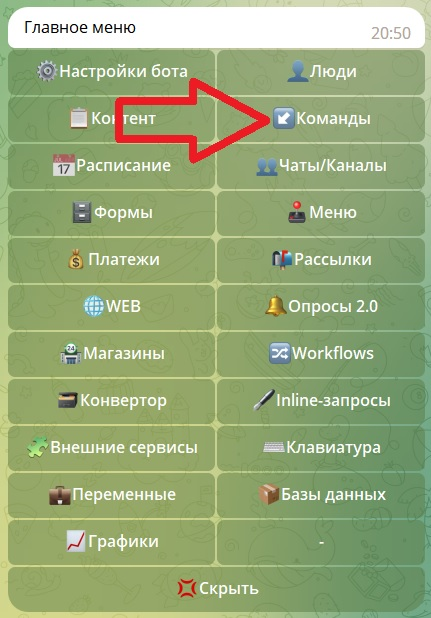
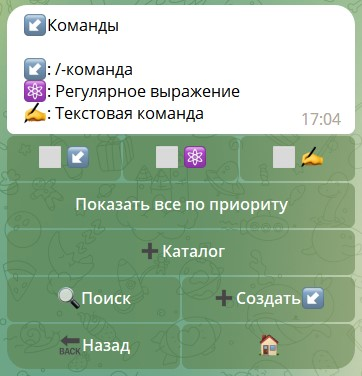
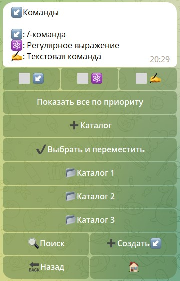
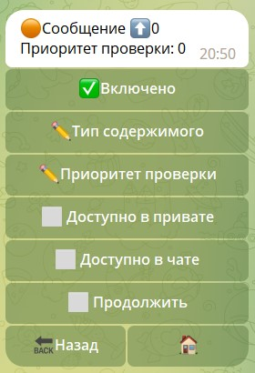
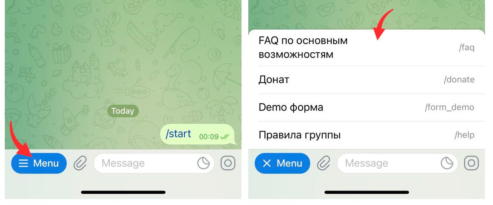
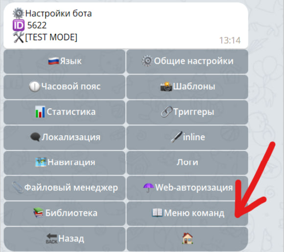
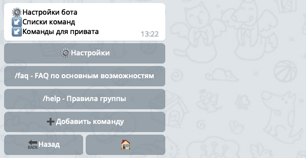

# Команды

Команда в Телеграме это текст, который начинается с символа /, например `/menu`. Если такая команда встречается в тексте, 
на неё можно нажать и ваш бот получит сигнал о том, что пользователь выбрал какую, то команду. Отправить команду в чат 
пользователь может 3 способами:

* Набрать текст команды вручную
* Нажать на команду в тексте переписки, если есть
* Выбрать в Меню команд Telegram, об этом [ниже](#меню-команд)

::: warning Обратите внимание
Наличие команд, таких как `/start` или `/menu`, не означает что ваш бот должен как то 
отреагировать на эти команды. После создания команды в Telegram, вам необходимо в своем боте указать какие действия 
бот выполнить в ответ на использование команды. Делается это с помощью [команд qnext](#команды-в-qnext).
:::

## Команды в [botfather](https://t.me/botfather)

Телеграм позволяет создавать до 100 команд публичных команд для бота через [@botfather](https://t.me/botfather)

Правила создания команд в [botfather](https://t.me/botfather)
* Команда должна начинаться с символа косой черты `«/»`
* Команда не может быть длиннее 32 символов
* Команды могут состоять из букв латинского алфавита, цифр и подчёркивания.
* Описание поддерживает заглавные, строчные буквы, а так же эмодзи.

Примеры допустимых команд:

::: tip Примеры валидных команд
* commandmode - ОпиСаНие
* co111andmode - описание 
* command_mode - описание
:::

## Команды в QNext

Команды в [QNextbot](https://t.me/qnextbot) это комплекс, состоящий из условия и реакции. 

* Условие - это текст/команда/регулярное выражение или любая другая сущность, которую, можно отправить в чат и на которую 
бот должен реагировать. 
* Реакция - это заранее настроенное действие, или набор действий, которые бот выполнит, при выполнении условия срабатывании. 

Таким образом, вы создаете в qnext команду, у каждой команды есть свой триггер, в триггере вы указываете список реакций, которые 
необходимо выполнить при выполнении команды. Например, можно в ответ пользователю прислать какой-то текст, контент с опросом 
или предложить заполнить форму. Создаются команды qnext в соответствующем разделе меню:

::: details Подробнее



:::

### Работа с командами в QNext

Интерфейс раздела команды имеет несколько различных настроек и функций. Рассмотрим все внимательно.

::: details Подробнее



:::

#### Фильтры

| Тип                  | Описание                                                               | Примеры                                      |
|----------------------|------------------------------------------------------------------------|----------------------------------------------|
| Команда              | команда на английском языке начинающая с символа "/" в начале          | `/cmd` `/txt` `/ping`                        |
| Регулярное выражение | регулярные выражения, которые позволяют охватывать разные типы текстов | [Примеры с пояснениями](/docs/admin/regexp/) |
| Текстовая команда    | любой произвольный текст                                               | `текст`  `команда`  `слово`                  |

#### Каталоги

В разделе команд существует возможность каталогизации всех команд по папкам. Каждому каталогу можно задать свои ограничения.

::: details Подробнее



:::

::: warning
Каталоги созданные внутри каталогов, не несут наследственные ограничения. Таким образом, если создаете каталоги внутри 
каталогов, им нужно присваивать отдельные ограничения.
:::

При установке команд, настоятельно рекомендуем использовать логи. Там вы сможете увидеть ошибки, которые вернул вам Telegram, 
если вдруг вы выполнили недопустимый запрос, например если указали недопустимый язык пользователя или название команды. 
Иногда телеграм может кешировать список команд, поэтому если вы не видите изменения, попробуйте перезапустить вашего клиента, 
чтобы сбросить кеш.


### Типы команд

Платформа предлагает создание реакций на различные типы сущностей. Доступные типы реакций:

| Тип                 | Описание                                                                                                                                          |
|---------------------|---------------------------------------------------------------------------------------------------------------------------------------------------|
| Текстовые сообщения | отслеживает все текстовые сообщения `${update.message.text}`                                                                                      |
| Опросы              | отслеживание создания опросов `${update.message.poll}`                                                                                            |
| Кости (dice)        | отслеживание отправки игровых эмодзи `${update.message.dice}`. Полный список костей в [документации](https://core.telegram.org/bots/api#senddice) |
| Геопозиции          | отслеживание отправки геопозиций `${update.message.location}`                                                                                     |
| Контакты            | отслеживание отправки контактов `${update.message.contact}`                                                                                       |
| Игры                | отслеживание игр `${update.message.game}`                                                                                                         |

::: danger ВАЖНО
Команды типа "ВСЕ" "ВСЕ СООБЩЕНИЯ", Регулярные выражения типа "`(.+)`" могут и чаще всего будут перехватывать любые 
другие команды. Если вы собираетесь использовать подобные команды, то обязательно прочтите [о приоритетах](/admin/command/#приоритет)

:::

### Настройки команд

Выполнение команд в QNext
По умолчанию бот обрабатывает все команды в порядке их создания, начиная с первой созданной. Такую последовательность обработки команд можно изменить, указав в настройках команды [Приоритет проверки](/admin/command/#приоритет).

Интерфейс позволяющий настраивать поведение команд

|        Функция         | Описание                                                                                                                         |
|:----------------------:|----------------------------------------------------------------------------------------------------------------------------------|
|  **Тип содержимого**   | Функция отвечает за редактирование сущности команды.                                                                             |
|     **Приоритет**      | Задание приоритет порядку обработки команд. [Важно прочитать](/admin/command/#приоритет)                                         |
| **Доступно в привате** | Редактирование реагирования команды в личном чате с ботом                                                                        |
|  **Доступно в чате**   | Редактирование реагирования команды в групповых чатах                                                                            |
|     **Продолжить**     | Определяет, сколько команд будет выполнено. По умолчанию только первая по условию. [Важно прочитать](/admin/command/#продолжить) |

::: details Подробнее



:::

#### Приоритет

Приоритет проверки изменяет последовательность обработки команд в боте. Сначала обработаются команды с установленным 
положительным значением Приоритета проверки, затем с нулевым значением в порядке их создания и после с отрицательным 
значением Приоритета проверки.

::: danger ВАЖНО
При создании команды Приоритет проверки имеет значение равное нулю.
Чем больше число установленное в параметре: Приоритет проверке, тем раньше будет обработана команда. 
В параметре допускаются отрицательные значения.
При обработке команд ботом, будет выполнена та команда, которая соответствует условиям для выполнения команды. 
Следующие команды не будут обработаны, если в настройках выполняемой команды не установлен параметр: Продолжить.
:::

#### Продолжить

Включенный в команде параметр Продолжить в случае выполнения команды не остановит процесс обработки команд в боте, 
а позволит продолжить его.

::: danger ВАЖНО
Включенный в команде параметр Продолжить позволит выполнить несколько команд бота, в случае совпадении условий для их выполнения.
:::


## Меню команд

Под меню команд в Telegram подразумевается меню, которое открывается на стороне клиента при выборе кнопки `"/"`:


В обновлении Telegram [от 25 июня 2021](https://core.telegram.org/bots/api#june-25-2021) это меню сильно изменилось, и в 
привате с ботом оно открывается с помощью кнопки с текстом `Меню` в левом нижнем углу:



Это меню команд позволяет быстро найти и выбрать нужную команду.

Также в новой редакции [Telegram bot api](https://core.telegram.org/bots/api) позволяет настроить вашего бота так, 
чтобы список команд был разным в различных ситуациях:
* В привате с ботом можно сделать один набор команд, а в какой-нибудь группе - другой.
* Все администраторы чата или бота видели один список команд, а все остальные пользователи - другой.
* Локализовать описания команд, т.е. сделать так, чтобы пользователям с разными языками отображался список команд с 
описанием на их родном языке. 
* А можно это все применить сразу и получить полный контроль над списком команд...

Для создания меню команд, нам потребуется перейти в раздел:
```plain
/main -> ⚙️Настройки бота -> 📖Меню команд:
```



## Списки команд
В этом разделе необходимо создать списки команд, которые потом вы будете показывать при различных условиях. Нажмите кнопку ➕Создать↙️, и укажете название вашего списка. Далее необходимо создать кнопки, которые будут отображаться пользователю в этом списке:



При создании кнопки сначала необходимо ввести Telegram-команду в формате `/my_command`, а затем необходимо ввести 
описание этой команды, которое будет отображаться рядом с командой в `Меню команд`.

Вы можете создать, например несколько списков с одними и теми же командами, но с разным описанием для разных 
языков пользователей.

После создания списков команд, переходим в раздел 🚦Области видимости.

### Области видимости

В разделе 🚦Области видимости вы указываете какие ↙️Списки команд необходимо показывать при определенных условиях. 
_Далее Области видимости будем сокращенно писать так 🚦ОВ._

Нажмите кнопку ➕Создать🚦 и выберите тип области видимости из предложенного списка:

|           Тип            | Описание                                                                                                                                                                                                    |
|:------------------------:|-------------------------------------------------------------------------------------------------------------------------------------------------------------------------------------------------------------|
|     **По умолчанию**     | команды применяются для всех пользователей без разбора, включая приват с ботом и группы.                                                                                                                    |
|  **Все приватные чаты**  | команды из этой 🚦ОВ отображаются у всех пользователей в привате с ботом. Команды НЕ отображаются в группах.                                                                                                |
|  **Все групповые чаты**  | команды из этой 🚦ОВ отображаются во всех групповых чатах. Команды НЕ отображаются у пользователей в привате с ботом.                                                                                       |
|   **Все админы чатов**   | команды отображаются у всех администраторов всех чатов. Команды НЕ отображаются у пользователей в привате с ботом.                                                                                          |
|     **Пользователь**     | команды отображаются только у одного конкретного пользователя. При создании 🚦ОВ надо указать пользователя. Команды НЕ отображаются в группах.                                                              |
|         **Чат**          | команды отображаются только в одном конкретном групповом чате. При создании 🚦ОВ надо указать групповой чат. Команды НЕ отображаются у пользователей в привате с ботом.                                     |
|     **Админы чата**      | команды отображаются только у администраторов одного конкретного чата. При создании 🚦ОВ надо указать групповой чат. Команды НЕ отображаются у пользователей в привате с ботом.                             |
|    **Участник чата**     | команды отображаются только у одного конкретного участника в одном конкретном чате. При создании 🚦ОВ надо указать групповой чат и пользователя. Команды НЕ отображаются у пользователей в привате с ботом. |

В зависимости от выбранного типа, далее бот может предложить выбрать дополнительные параметры, например чат и/или пользователя. 

На следующем шаге необходимо указать **ISO 639-1** код языка пользователя, например _ru_ или _en_. Вы можете не указывать язык, нажав на кнопку Пропустить, в этом случае 🚦ОВ будет применяться без проверки языка пользователя. Но если же вы укажите язык, тогда эта область видимости будет применена к пользователю только в том случае, если язык пользователя совпадает с указанным вами при создании 🚦ОВ. Например, можно создать две 🚦ОВ по умолчанию для русско- и англо- говорящих пользователей, и показывать им разные списки команд с локализованным описанием. 

⚠️Если вы создали множество ↙️Списков команд и соответствующих 🚦Областей видимости, в каждый момент времени пользователь в привате или в группе может видеть только 1 единственный список команд. Какой именно список команд показывать пользователю определяется следующими алгоритмами. Условия проверяются сверху вниз, т.е. сперва верхнее, если условия не совпадают, тогда проверяется следующее и так до тех пор, пока не будет найдена 🚦ОВ и соответствующий ей ↙️Список команд.

**Если пользователь находится в привате с ботом:**
* 🚦Пользователь `+ язык пользователя`
* 🚦Пользователь _(без указания языка)_
* 🚦Все приватные чаты `+ язык пользователя`
* 🚦Все приватные чаты _(без указания языка)_
* 🚦По умолчанию `+ язык пользователя`
* 🚦По умолчанию _(без указания языка)_

**Если пользователь находится в групповом чате:**
* 🚦Участник чата `+ язык пользователя`
* 🚦Участник чата _(без указания языка)_
* 🚦Администратор чата `+ язык пользователя`
* 🚦Администратор чата _(без указания языка)_
* 🚦Чат `+ язык пользователя`
* 🚦Чат _(без указания языка)_
* 🚦Все админы чатов `+ язык пользователя`
* 🚦Все админы чатов _(без указания языка)_
* 🚦Все чаты `+ язык пользователя`
* 🚦Все чаты _(без указания языка)_
* 🚦По умолчанию `+ язык пользователя`
* 🚦По умолчанию _(без указания языка)_


