# Контент
Основные задачи при которых контент подходит лучше всего, это:
* **Посты для каналов**
* **Опросы**

## Создание нового контента

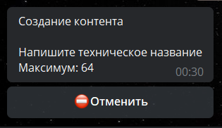

**Техническое название** — название которое будут видеть только админы бота (пользователям оно недоступно)

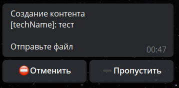

**Файл** — загрузить файл, есть лимиты*

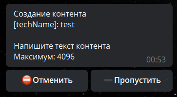

**Текст для пункта контента** — текст который увидят пользователи, когда получат этот контент.


## Создание контента из шаблона

Для создания шаблона, требуется уже созданный и настроенный под наши задачи контент.

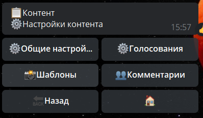

Шаблоны — создать новый — ввести название — готово.

Возвращаемся в Контенты — создать — создать из шаблона — готово.

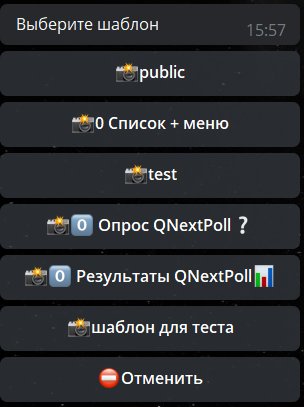

### Лайфхак

Если в названии указать макрос:
```plain 
!{template| text: напишите название контента}
```

То при создании контента из шаблона бот будет запрашивать название для каждого контента. Такой же макрос можно использовать в любом месте где требуется указать текст, например в названиях кнопок: 
```plain 
!{template| text: напишите название кнопки}
```

или например чтобы указать ссылки для кнопок типа url:
```plain 
!{template| text: напишите url кнопки}
```


### Настройка

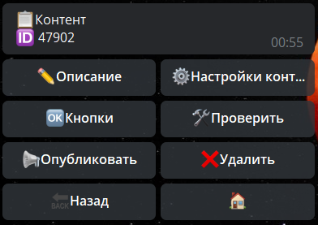


### Описание

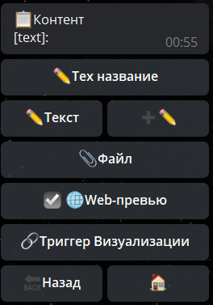

**✏️Текст** — редактирует весь текст контента

➕✏️— добавляет текст к уже имеющемуся 

**📎Файл** — добавить файл

**🌐Web-превью** — отключает превью всех ссылок в контенте

🔗**Триггер Визуализации** — срабатывает каждый раз перед публикацией (или обновлением) контента. в Триггере можно производить расчеты и отображать в теле контента.


### Настройки контента

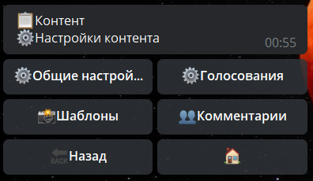


### ⚙️Общие настройки

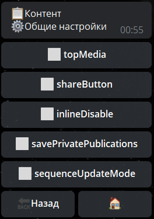
* **topMedia** — изображение будет отображаться сверху (как файл, а не как превью ссылки).
(Автоматически отмечается для файлов большого размера*. Не доступно, если в текущем контенте нет файла)
*Размеры файлов можно определить по лимитам Telegraph. — Всё что превышает ограничения сервиса — считается в данном случае, файлами большого размера.
* **shareButton** — кнопка "поделиться". 
**ПРИМЕЧАНИЕ**: Данная кнопка не совместима с публикацией ботом контента в каналах (ограничение Telegram). Контент с такой кнопкой может быть опубликован в чатах, или с помощью инлайн.
* **inlineDisable** — отключает контент для инлайн поиска, т.е. контент не будет отображаться в inline режиме. 
* **savePrivatePublication** — запоминать публикации в личке (они будут обновляться при голосовании). Имейте ввиду что если таких публикаций будет много, обновляться они будут крайне медленно (телеграм не разрешает массовые быстрые обновления публикаций).
* **sequenceUpdateMode** — если включить, тогда публикации будут обновляться последовательно, т.е. один за другим а не все сразу. Это важно потому что если включить savePrivatePublications и отправить публикацию 100 юзерам, а потом все сразу попытаться обновить публикацию - телега начнет блокировать этого бота за массовую рассылку.


### Голосование

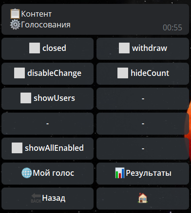

Для того чтобы включить пункт - поставьте флажок ✔️
* **closed** — Закрыть голосование.
* **withdrawn** — Разрешить удаление голоса.
* **disableChange** — Запретить смену голоса.
* **hideCount** — Скрыть подсчет голосов на кнопках.
* **showUsers** — Отображать в теле голосования имена респондентов.
* **showEmpty** — Показывать в теле опроса кнопки без голосов
* **compactMode** — Компактный режим
* **usersInRow** — Если включить, пользователи будут отображаться в ряд, а не столбиком 
* **showAllEnabled** — дать возможность пользователям видеть все голоса (для этого используйте макрос !{macros.open}vote| type: all}
* **📊Результаты** — в этом пункте можно ознакомится с результатами голосования, или аннулировать их.

Админ бота теперь может удалить голос любого пользователя в опросе. Для этого необходимо кликнуть на имя пользователя в окне просмотра результатов.
* **🌐Мой голос** - эта опция создаст общую для всех пользователей ссылку, с помощью которой они всегда смогут проверить, как они проголосовали в этом контенте.


### 📸Шаблоны

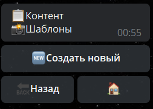

Создание шаблона из контента.

Позволяет сохранить в шаблонах копию созданного вами контента, для того что б в дальнейшем создавать контент по готовому образцу.

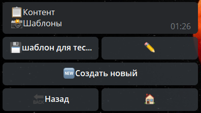

Все созданные шаблоны находятся в разделе: Настройки бота - Шаблоны


### 👥Комментарии

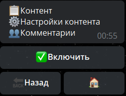


### Кнопки

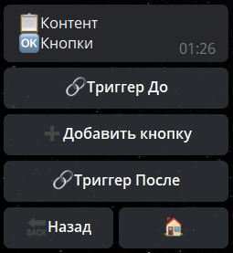

**Триггер До** — срабатывает, при нажатии на любую из кнопок, перед срабатыванием триггера самой кнопки.


### Добавить кнопку

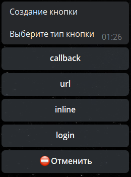

Типы кнопок:
* **callback** — вызов действия
* **url** — вставить ссылку для прямого открытия ресурса (не предусматривает использование реакций или счетчиков)
* **inline** — позволяет настроить inline — запрос на вызов различного контента.
 

*! ПРИМЕЧАНИЕ — нет возможности публиковать контент с инлайн-кнопками в каналах. Особенность Телеграма.**
* **login** — подробнее [по ссылке](https://core.telegram.org/widgets/login)

**Триггер после** — срабатывает, после нажатия на одну из кнопок, и после триггера кнопки


### Проверить

Публикация контента в чате с инициатором нажатия на кнопку.


### Опубликовать

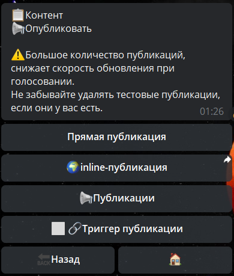

**Прямая публикация** — публикация контента ботом в чат где есть бот

**🌍 inline-публикация** — публикация в любой чат контента от вашего имени

**📢 Публикации** — показывает все публикации контента

**🔗 Триггер публикации** — срабатывает каждый раз при новой публикации контента ботом, либо при его редактировании (ВАЖНО: Работа данного триггера даёт большую нагрузку на сервис. Поэтому, настоятельно не рекомендуется злоупотреблять данной функцией.)


### Удалить

Удаление контента. Безвозвратно.

--------------------
**Реакции**

[loadContent](/docs-test/admin/content/loadcontent) - Загрузить Контент

[loadRandomContent](/docs-test/admin/content/loadrandomcontent) - Выбрать случайный контент

[sendContent](/docs-test/admin/content/sendcontent) - Отправить Контент

[refreshContent](/docs-test/admin/content/refreshcontent) - Обновить контент
