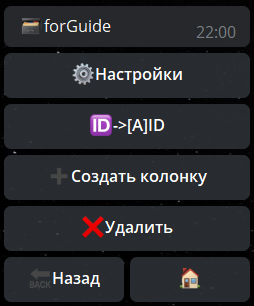

Конвертор - раздел для выгрузки данных.

На данный момент работает в 3х режимах:
* Выгрузка данных в Excel
* Выгрузка данных в csv
* Выгрузка данных в Google

**Имеет следующие колонки:**
— ID - ID пользователя

— Название - название товара

— Описание - описание товара

— Цена - цена товара

— Количество - количество товара

— Итоговая сумма - сумма цен

— Артикул - Тип или род изделия, товара

— Серийный номер - уникальный идентификатор

— Валюта - валюта магазина (указывается в международном формате RUB USD EUR, [**подробнее по ссылке**](https://ru.wikipedia.org/wiki/%D0%A1%D0%BF%D0%B8%D1%81%D0%BE%D0%BA_%D0%B7%D0%BD%D0%B0%D0%BA%D0%BE%D0%B2_%D0%B2%D0%B0%D0%BB%D1%8E%D1%82))

— Имя пользователя - первое и второе имя пользователя (**first_name + last_name**)

— Альтернативное имя - 

— username пользователя - @username пользователя

— ссылка на пользователя - открывает профиль пользователя в ТГ

— админская ссылка - открывает профиль пользователя в боте

— Поле формы - показывает результат указанного поля

— Версия - показывает версию формы (настройки формы - версия_

— Дата создания - 

— Дата старта - 

— Дата добавления - 

— Категория - 

— Ссылка на файл - 

— Статус пользователя - 

— Параметр профиля - показывает содержимое определенного профиля пользователя

— Скрытый - 

— Дополнительный - 

— Произвольное значение - Колонка отвечающая за работу с **Google таблицами**!
