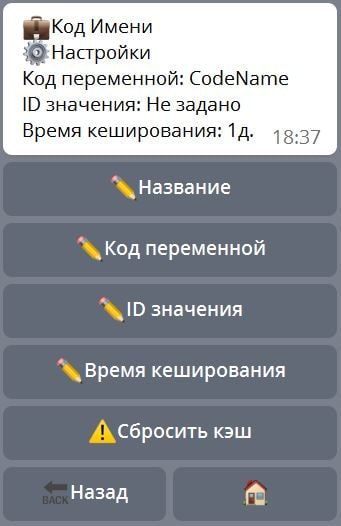

# Динамические переменные

**Динамические переменные** — переменные, которые используются, когда необходимо в нескольких местах получить какое либо значение путем сложных вычислений. Полученное значение кэшируется на указанное время.

Например: необходимо загрузить json строку, выделить из неё какое то значение и преобразовать его с помощью скрипта. Все эти действия могут выполняться длительное время, особенно загрузка по сети. 

Для выполнения этой задачи можно использовать 💼Динамическую переменную, у которой есть свой 🔗Триггер Сборки. Внутри триггера сделать все необходимые вычисления, а затем сохранить значение с помощью реакции ⚡️writeDynamicVariable. 

После создания Динамической переменной, в том месте, где нужно получить значение этой переменной, необходимо вызвать реакцию ⚡️readDynamicVariable. Эта реакция выполнит 🔗Триггер Сборки и сохранит значение в кэше. В следующий раз, когда будет выполнена реакцию ⚡️readDynamicVariable, бот проверит наличие переменной в кеше, а также проверит время кеширования, если время вышло - бот выполнит тригер сборки динамической переменной и вернет обновленное значение.

После реакции ⚡️readDynamicVariable значение динамической переменной будет доступно в переменной ```${dynamicVar.CodeName}```, где CodeName - это код динамической переменной.




**Название** — Название динамической переменной.

**Код переменной** — Код (имя) динамической переменной. Служит для идентификации переменной, при обращении к ней, для получения значения.

**ID значения** — Идентификатор значения динамической переменной. Например: если необходимо, для каждого пользователя бота, создавать свое значение динамической переменной, то в ID значения можно записать переменную ${user.id}.

**Время кеширования** — Время в течении которого, динамическая переменная не будет обновлять свое значение при обращении к ней. Значение переменной берется из кэша.

-------------------------------

**Реакции**

| Реакция | Описание |
| --- | --- |
|[dynamicVarDel](/docs/admin/dynvar/dynamicVarDel)|Удалить значение динамической переменной|
|[loadDynamicVar](/docs/admin/dynvar/loadDynamicVar)|Прочитать динамическую переменную|
|[dynamicVarSet](/docs/admin/dynvar/dynamicVarSet)|Записать динамическую переменную|
 


