# Формы

**Форма** - универсальное средство приема данных от пользователей.

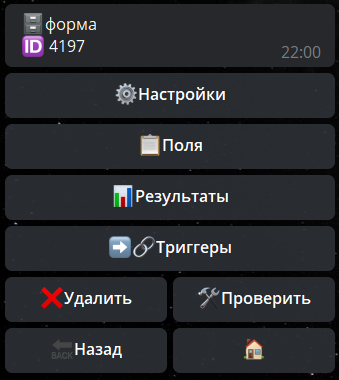
## Настройки 
## Ограничения

— Применяются все предлагаемые платформой [**ограничения**](/docs-test/restrictions).

### Тех. название 

—  Название формы которое видно только админам.

### Заголовок 

— Текст, который будет отображаться в шапке каждого поля

### Локализация

—  Изменение текста системных кнопок бота. 

Предусмотрены следующие текста для изменения:
* Отменить форму
* Пропустить
* Далее
* Выбрать
* Предоставить телефон
* Предоставить геопозицию
* Выбрать пользователя

### Результаты
— 
### Нельзя отменить

— Разрешение или запрет пользователю отменять форму
### Не сохранять результаты

— Если вам не нужны результаты пройденных форм, можно отключить их хранение.
### Чистить историю

— Удаление или сохранение пройденных результатов форм.
* ☑️ Чистить историю - пройденные поля будут удаляться
* ◻️ Чистить историю - пройденные поля будут оставаться в чате
### Разрешить команды

— Настройка реакций бота на команды во время прохождения формы: Будет реагировать или нет.
### Разрешить кнопки клавиатуры

— Настройка реакций бота на клавиатуру во время заполнения формы: Будет реагировать или нет.
### Ограничение количества

— Ограничивает количество раз, которое пользователь может запустить и пройти форму.
### Ограничение времени

—
### Версия

—
### Google таблицы

— Подключение и вывод результатов формы в [**Google таблицы.**](/docs-test/admin/google)
### Конвертор

— Подключение конвертора для вывода результатов формы в [**Google таблицы**](/docs-test/admin/google) или Excel
### Workflows 

—
## Поля
**Общие настройки полей - индивидуальные настройки для каждого поля.**

— Ограничения Поля

— Выключено

— Скрыть в результатах

— Не показывать Web-превью

— Изменить название

— Изменить текст

— Изменить фото

— Карта настроек

— Завершить форму

— Не обязательный

— Статистика

**Поля:**
## Поле: choose

— Поле предназначенное для мультивыбора вариантов ответов. Можно выбирать несколько вариантов.

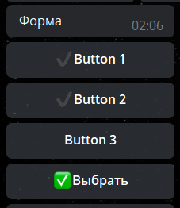
## Поле: select

— Поле для выбора одного варианта ответа. Можно выбрать только один вариант.

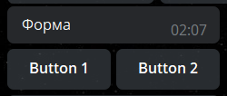
## Поле: branch

— Поле представляющее из себя форму внутри поля. Внутри каждой кнопки можно создать свои поля со своими кнопками.
## Поле: text

— Поле для приема текстовых сообщений.
Пример: _текст, кастомный текст._

Имеет следующие настройки:
* Минимум и Максимум: определяет количество символов которое будет принимать поле.
* Регулярное выражение - регулирование и контроль вводимого текста.
* Форматированный текст - поддержка и сохранение введенного форматированного текста.
## Поле: number

— Поле для приема числовых значений.
Пример: _1, 123456, 64562456._

Имеет следующие настройки:
* Минимум и Максимум: определяет диапазон чисел которые будет принимать поле. Например: от 1 до 100.
* Дробное число: позволяет вводить данные типа 110.1, 56.47.
## Поле: email

— Поле для приема адресов электронных почт
Пример: mail@mail.ru, ya@ya.ru.

## Поле: phone

— Поля для приема телефонных номеров.

Имеет 2 режима работы:
* Предоставление номера с помощью кнопки "Предоставить номер"
* Опция "ввести номер Текстом" - позволяет пользователю отправить номер текстом.
## Поле: geo

— Поле для приема геолокации пользователя с помощью кнопки "Отправить геолокацию"
## Поле: url

— Поле для приема любого типа ссылок.
Пример: qnext.app, t.me.

## Поле: image

— Поле для приема изображений*
**update.message.photo**: jpg, bnp и т.д.
!!! не путайте с файлами

## Поле: video

— Поле для приема видео*
**update.message.video**: avi, mp4, mkv и т.д.
!!! не путайте с файлами

## Поле: media

— Поле для приема файлов типа медиа*

**update.message.photo**: jpg, bnp и т.д.

**update.message.video**: avi, mp4, mkv и т.д.

update.message.audio: mp3, wav, flac и т.д.
## Поле: file

— Поле для приема файлов типа документ*

update.message.document*
## Поле: audio

— Поле принимает аудио*
update.message.audio: mp3, wav, flac и т.д.
!!! не путайте с файлами

## Поле: voice

— Поле принимает голосовые записи*
Только формат ogg
## Поле: duration

— Поле для указания произвольного значения времени

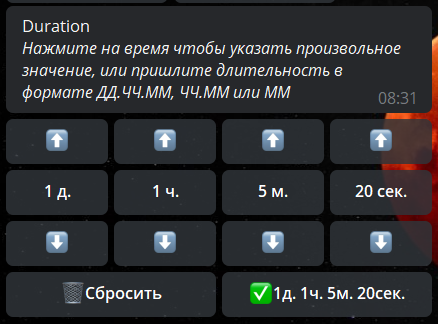
## Поле: info

— Поле для отображения информации

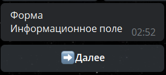
## Поле: date

— Поле для указания даты. 

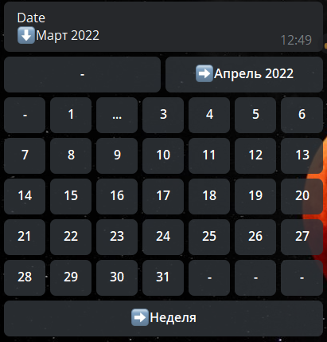

Имеет несколько настроек:
* **Исключения -** Разрешает выбирать только выходные, или только будничные дни.

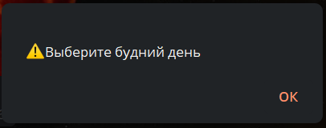
* **Прошлое время -** По умолчанию можно выбрать только настоящее и будущее время. Эта функция позволяет указывать прошлое время
* **Шаблон** - позволяет указывать дату в виде текста с соблюдением формата.
* **Скрыть календарь** - скрывает календарь ввиде кнопок, оставляя возможность ввести дату только цифрами.
## Поле: secret

— Устарело. Будет удалено.
## Поле: selectContent

— Поле для выбора и загрузки данных контента для дальнейшей работы с этим контентом.
## Поле: selectButton

— Поле для выбора и загрузки данных кнопки контента для дальнейшей работы с этой кнопкой из контента.
## Поле: mention

— Поле принимает @username пользователей
## Поле: sticker

— Поле принимает стикеры
## Поле: time

 — Поле для указания времени в формате часы:минуты

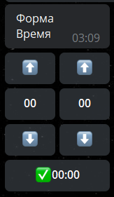
## Поле: list

— Поле для вывода больших списков кнопок с помощью инлайн вывода.

Особое удобство поля в том, что кнопки загрузить с помощью JSON кода:

**Пример работы поля:**

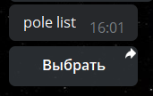

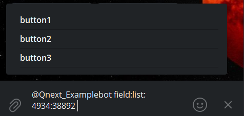

Особое удобство поля в том, что кнопки загрузить с помощью JSON кода:
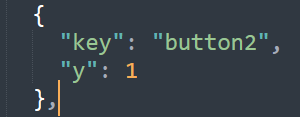
## Поле: pay

—
## Поле: hidden 

— Скрытое поле. Удобное поле для передачи данных в форме без отображения содержимого в результатах форм, а так же для пользователя.
## Поле: custom

Поле для приема любого типа данных (в том числе смешанных). Может одновременно принимать и ссылки и цифры, или ссылки и юзернеймы. 
Работает с связке с реакцией: [**writeFormCustom**](/docs-test/reactions/writeformcustom)
## Поле: user

— Поле для выбора пользователя бота.

Имеет настройки поля: 

**Кандидаты** - позволяет выбрать определенную группу лиц, из которых можно будет выбрать пользователей:

**Типы пользователей:**
* Все пользователи бота
* Список пользователей
* Состоит в списке
* Не состоит в списке
* Контент
* Проголосовал
* Не проголосовал

**Исключения:**

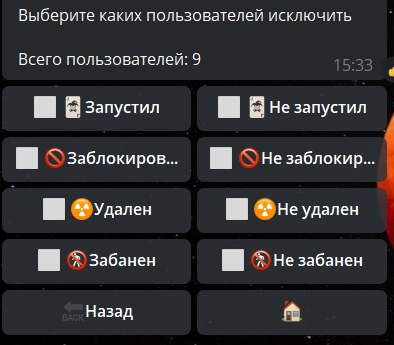
## Поле: menu

— Поле для выбора ранее созданного раздела меню.

## Триггеры

— Отображение всех результатов пройденных форм пользователями.
## Триггер Старт

— Триггер срабатывает первым и единожды при запуске формы. 
## Триггер Поля До

— Триггер срабатывает перед запуском поля. 

Например, если вам нужно произвести какие-то расчета для дальнейшей работы, или же загрузить какие-то данные.
## Триггер Поля После

— Триггер срабатывает после принятия данных в форме
## Триггер Кнопки

— Триггер срабатывает при нажатии на кнопки (поля типа select, choose, branch)
## Триггер лимита количества

— Триггер срабатывает при превышении лимита количества прохождений формы.
## Триггер лимит времени

— Триггер для ограничения частоты прохождения формы. Если выставить 1 час - форму можно будет проходить не чаще, чем раз в 1 час.
## Триггер Отмена

— Триггер отмены срабатывает после нажатия на кнопку "**Отменить форму**"
## Триггер Финиш

— В триггере финиша работает реакция  [**formResult**](/docs-test/reactions/formresult), которая отображает данные пройденной формы.

**Особенности**

***Maximum file size to download is 20 MB**

[**https://core.telegram.org/bots/api#file**](https://core.telegram.org/bots/api#file)

**Реакции**

 [**formStart**](/docs-test/reactions/formstart)- Запустить форму

 [**formCancel**](/docs-test/reactions/formcancel) - Остановить (прервать) форму

 [**formResult**](/docs-test/reactions/formresult) - Показать результат формы

 [**loadFormResult**](/docs-test/reactions/loadformresult) - Загрузить результаты формы

 [**openFormResult**](/docs-test/reactions/openformresult) - Открыть результаты формы

 [**takeFormResults**](/docs-test/reactions/takeformresults) - Получить последние несколько результатов формы

 [**saveFormVariables**](/docs-test/reactions/saveformvariables) - сохранить локальную переменную в поле формы

 [**writeFormCustom**](/docs-test/reactions/writeformcustom) - записать произвольный параметр поля формы

