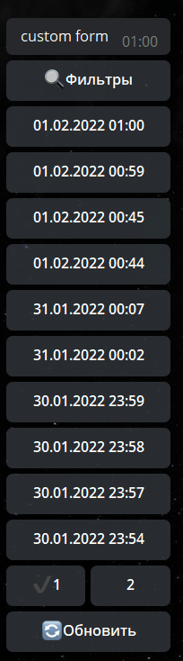

# openFormResult

**openFormResult** - открытие результатов формы определенного пользователя. По умолчанию загружаются результаты формы инициатора. 

Предлагает возможность задать следующие настройки:

* Выбрать форму - выбор форм из ранее созданных
* Открыть список - открывает списком все пройденные пользователем формы

* Кнопка Назад - включение или отключение возможности возвращаться к списку результатов форм после выбора определенного результата.

