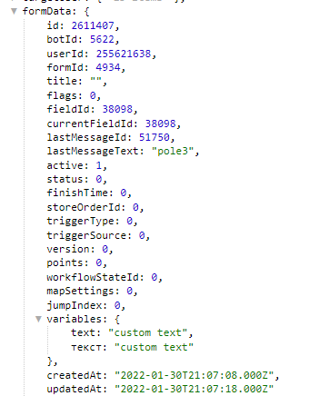

# saveVariables

**saveVariables** - сохранение локальные переменных при запуске формы, а так же во время прохождения формы.

Локальные переменные доступны в любой момент во время заполнения формы. Получить значения переменных можно по адресу: 

```plain
${formData.variables...}
```

```yaml
      formData: {
        variables: {
          text: "custom_text",
          txt: "custom_text"
```

::: details Подробнее



:::

::: tip  Особенности

Все последующие реакции будут перезаписывать, а не дополнять перечень сохраненных переменных, т.о. если вам нужно сохранить ранее созданные переменные, их придется пересоздать с помощью ЛП.

:::
::: details Подробнее


