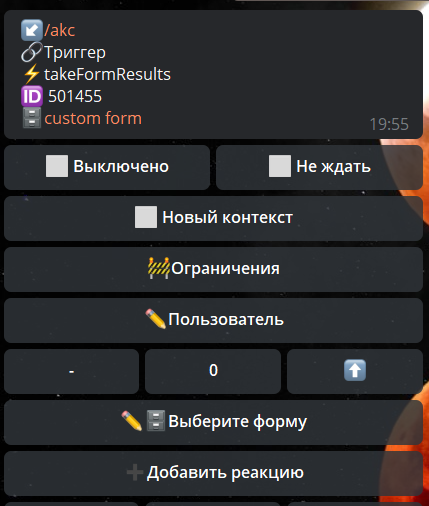

# takeFormResults

**takeFormResults** - загружает указанное количество результат форм пользователя с конца.

Реакция для обработки результатов форм пользователя.

::: details



:::

ID Результатов будут находиться по пути: 

```plain
${formDataList.0.id}
```


