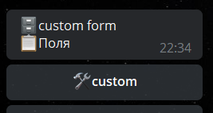

# writeFormCustom
**writeFormCustom** - реакция связанная с полем форме: **custom.** 

Позволяет принимать совершенно любой текст или файлы/медиа.



По умолчанию, поле не будет принимать какие-либо данные, пока в триггере подготовки поля не указать соответствующую реакцию **writeFormCustom.** 

---

**Пример использования.**

Нам нужно принимать данные, только если это:
* @username (type: mention)
* ссылка (type: utl)

Как нам это реализовать:

Триггер обработки поля **custom**
``` plain
for ${update.message.entities}
— **groupReactions** 
Ограничения:
string ${forItem.value.type} = mention
  or
string ${forItem.value.type}=url
— — writeFormCustom ```${update.message.text}```
```


