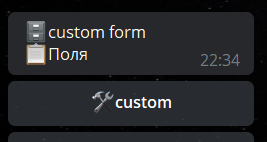

# writeFormCustom
**writeFormCustom** - реакция связанная с полем форме: **custom.** 

Позволяет принимать совершенно любой текст или файлы/медиа.

По умолчанию, поле не будет принимать какие-либо данные, пока в триггере подготовки поля не указать соответствующую реакцию **writeFormCustom.** 

---

**Пример использования.**

Задача: нам принять данные, только если это:

@username (type: mention)

ссылка (type: utl)

Как нам это реализовать:

Триггер подготовки поля **custom**

**for** _${update.message.entities}_

— **groupReactions** 

Ограничения:

**string** _${forItem.value.type}_ = **mention**

  or

_string ${forItem.value.type}=url_

— — **writeFormCustom** _${update.message.text}_

