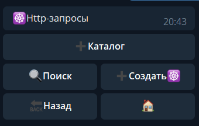
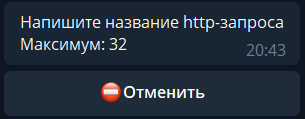
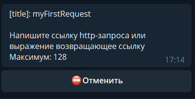
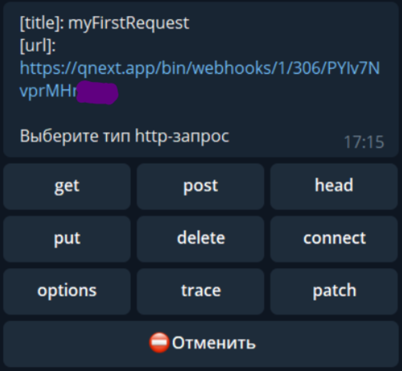
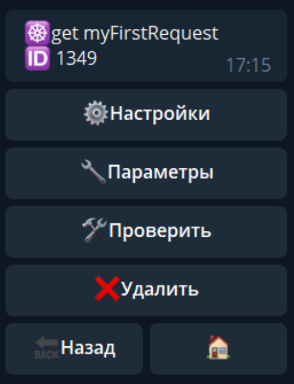
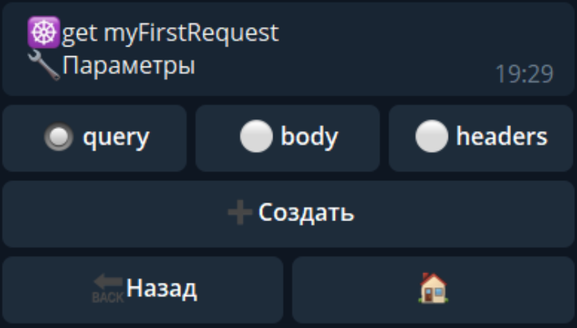

# http запросы
http-requests - запросы на api разных сервисов для получения от них различной информации, такой как погода, курсы, цены в магазине, каталоги, и другие варианты.

Рассмотрим процесс создания:

Название любое, произвольное. Рекомендуем использовать понятное в будущем название, например: 

requestFromSupportBot

Далее необходимо вставить ссылку, куда бот должен делать запрос. В нашем случае это будет запрос в другого бота на платформе Qnext ([кейс описан ниже](#инструкция))

Здесь необходимо выбрать метод, который будет использовать бот по умолчанию (он будет описан в документации к вашему API). По умолчанию большинство сервисов используют методы GET/POST (оба метода работают при общении ботов на платформе Qnext), этими методами мы и воспользуемся. Выбираем GET.

Здесь нам доступен выбор вариантов ответов, в каком формате должен быть получен ответ

Нам для теста потребуется text (он же HTML)

Практически все сервисы отдают данные в формате JSON (это правило практически всех современных сервисов)

**ГОТОВО, Поздравляем, запрос настроен!**

**Самый важный раздел в http-запросе**

В этом разделе вы можете указать какие параметры передавать вместе с вашим запросом. Чтобы понять какие параметры и в каком виде отдавать, вам необходимо обратится к документации того сервиса, который ожидает от вас запроса. Вы можете создать 3 типа параметров:

## query

Параметры типа query, это обычные который подставляются в ссылку после символа ?, и разделенные символом =. Вы просто создаете список нужных параметров и при выполнении запроса, бот сам добавит эти параметры в ссылку в нужном виде.
## body

Параметры типа body - это так называемые post-параметры, передать которые можно POST-запросом. Перейдя в эту вкладку, вы увидите дополнительные опции:
* ☑️`Шаблон body` - Позволяет указать любой текст, этот текст будет передан POST-запросом как есть.
* ☑️`Путь` - Здесь вы можете указать путь до до места где лежит значением, которое необходимо передать. Например если у вас в локальных переменных лежит Объект который надо передать, вы можете написать путь до этой переменной: `${localVar.myBodyObject}`.
* ☑️`Файл` - В этом разделе вы можете прикрепить к запросу файл.
## headers

Параметры типа headers - это заголовки вашего запроса. Например если api сервис который вы используете ждет запрос в формате JSON, обычно требуется заголовок с ключом `Content-Type` и значением `application/json`. 

Простой кейс настройки общения между ботами на платформе QNext

Нам потребуются 2 бота на платформе QNext:
 * 1 бот - будет отдавать информацию
 * 2 бот - будет запрашивать (и принимать информацию)

В 1 боте настраиваем:

🕸Webhooks 

— создать 

— 🔗Триггер 

— ⚡️Реакции 

— ⚡️webhookResponse - Пишем текст, который будет отправлен по запросу. Пример: OK

Заходим в настройки - копируем полученную ссылку формата:

[https://qnext.app/bin/webhooks...](https://qnext.app/bin/webhooks...)

В 2 боте настраиваем:

☸️Http-запросы 

— создать 

— вставляем ранее скопированную ссылку 

— тип http-запрос: get 

— формат ответа: text

Жмем проверить, получаем следующее:

