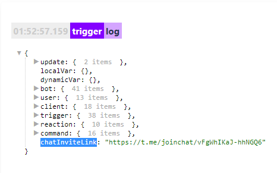

# exportChatInviteLink

**exportChatInviteLink** - Создание новой основную ссылку для приглашения в чат; любая ранее созданная первичная ссылка аннулируется.

Переменная для указания ссылки: 

```plain 
${chatInviteLink}
```

После использования реакции, результат работы реакции будет доступен в переменной:

::: details Подробнее

:::

::: tip  Особенности
Можно создать не более 10 ссылок за 60 секунд.
:::

---

[**bot.api method - exportChatInviteLink**](https://core.telegram.org/bots/api#exportchatinvitelink)

