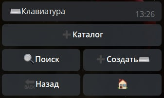
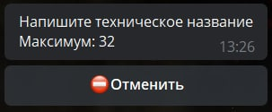
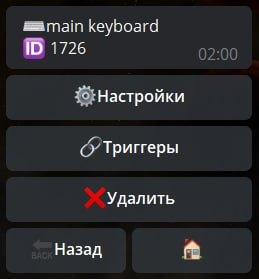
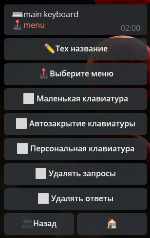

# Клавиатура
**Клавиатура** - кнопки отображаемые под полем ввода текста. 

Важно: клавиатуру можно отправить только вместе с сообщением. Нельзя отобразить клавиатуру без сообщения

---

**Интерфейс раздела клавиатура**

Для создания клавиатуры нам потребуется заранее созданное [Меню](/docs/admin/menu).
* Важно! Из-за особенностей работы _Telegram_, в клавиатуре могут быть только кнопки типа: **callback, login, contact.**

[Видео-инструкция по созданию клавиатуры](https://t.me/QNextCases/130)

---

**Создание клавиатуры**

Вводим техническое название

Выбираем ранее созданное и настроенное меню

**готово, клавиатура создана**

---

**Раздел настроек предусматривает следующие функции:**

* **Выбор меню** — которое будет использоваться как клавиатура

* **Маленькая клавиатура** - по умолчанию Телеграм отправляет большие кнопки (на пол экрана), эта функция применяет к ним минимальный размер.

* **Автозакрытие клавиатуры** - скрывает (не путать с удалением) клавиатуру после нажатия

* **Персональная клавиатура** - при вызове клавиатуры в чате, она будет отображена только у инициатора

* **Удалять запросы** -  удаление запросов отправляемых пользователем

* **Удалять ответы** - удаление предыдущих ответов присылаемых ботом

---

**Реакции**

[keyboardAction](/docs/admin/keyboard/keyboardaction) - выполнить действие при нажатии на кнопку
 
[keyboardHide](/docs/admin/keyboard/keyboardhide) - Скрыть клавиатуру
 
[keyboardRefresh](/docs/admin/keyboard/keyboardrefresh) - Обновить текущую клавиатуру
 
[keyboardShow](/docs/admin/keyboard/keyboardshow) - Показать клавиатуру
 

