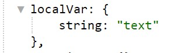
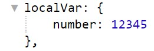
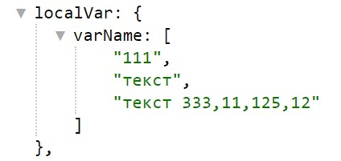
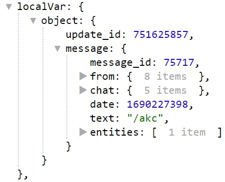

# Локальные переменные

**Локальные переменные** — переменные, которые можно создавать (присваивая им значения), изменять их значения и удалять в процесс работы триггера. Локальные переменные доступны с момента создания и до завершения работы любого триггера, включая Глобальный Триггер После. (Который всегда выполняется последним).

Например: переменная созданная в Триггере До меню, будет доступна в Триггере Раздела и в Триггере После. После завершения выполнения Глобального Триггера После, локальная переменная удаляется.

Предоставляется 4 типа локальных переменных:


| Тип                       | Описание                                        |
|---------------------------|-------------------------------------------------|
| [Любой объект](./#объект) | значение типа объект.                           |
| [Число](./#число)         | числовые значения.                              |
| [Строка](./#строка)       | текстовые значения.                             |
| [Список](./#список)       | список текстовых или числовых значений, массив. |


---

#### Примеры:

#### Строка

Локальная переменная сохраняющая текст типа строка. Например: "апельсин" или "яблоко это не груша"

::: details Подробнее



```json
  "localVar": {
      "string": "text"
    },
```

:::

---

#### Число

Локальная переменная сохраняющая цифры типа число. Например: 111, 222, 123, 546.

::: details Подробнее



```json
  "localVar": {
      "number": 12345
    },
```

:::

---

#### Список

Локальная переменная сохраняющая списки.

::: details Подробнее

Для примера рассмотрим переменную varName, тип: Список, 

Для получения значения переменной varName, используем:

* При обращении к переменной ```${localVar.varName}``` получим ее значение в виде списка: ```111, текст, текст 333,11,125,12```

* При обращении к первому элементу переменной ```${localVar.varName.0}``` переменная вернет значение первого элемента списка: 111.

* При обращении ко второму элементу переменной ```${localVar.varName.1}``` переменная вернет значение второго элемента списка: текст.

* Для того, что бы узнать количество элементов в списке: ```${localVar. varName.length}``` переменная вернет значение 3, на единицу превосходящее ключ списка.




```json
 "localVar": {
      "varName": [
        "111",
        "текст",
        "текст 333,11,125,12"
      ]
    },
```
:::

---

#### Объект


Локальная переменная сохраняющая объекты. Объект — это набор свойств, и каждое свойство состоит из имени и значения, ассоциированного с этим именем. Например: { фрукт: "апельсин"; вес: 250; цена: 51.20; }

::: details Подробнее



```json
   "localVar": {
      "object": {
        "update_id": 751625857,
        "message": {
          "message_id": 75717,
          "from": {
            "id": 1234567890,
            "is_bot": false,
            "first_name": "name",
            "last_name": "name",
            "username": "username",
            "language_code": "ru",
            "is_premium": true,
            "fullName": "name name"
          },
          "chat": {
            "id": 255621638,
            "first_name": "Akcium",
            "last_name": "Сергей",
            "username": "AkciumKicum",
            "type": "private"
          },
          "date": 1690227398,
          "text": "/akc",
          "entities": [
            {
              "offset": 0,
              "length": 4,
              "type": "bot_command"
            }
          ]
        }
      }
    },
```
:::

---


**Реакции**

| Реакция                                         | Описание                                 |
|-------------------------------------------------|------------------------------------------|
| [localVarAdd](/docs/admin/localvar/localvaradd) | Добавить значение в локальную переменную |
| [localVarDel](/docs/admin/localvar/localvardel) | Удалить локальную переменную             |
| [localVarSet](/docs/admin/localvar/localvarset) | Установить локальную переменную          | 
 


