# Меню

🕹 **Меню** — элемент интерфейса пользователя, позволяющий выбрать одну из нескольких перечисленных опций бота.

::: details Пример меню
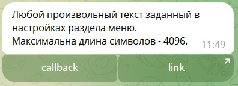
:::

## Создание меню

Создание меню состоит из 2-х простых этапов:

1. **Техническое название** — название, которое будут видеть только админы бота (пользователям оно недоступно):

2. **Текст для пункта меню** — текст, который увидят пользователи, когда откроют это меню.

_Готово, основа создана!_

::: details Интерфейс настроек меню
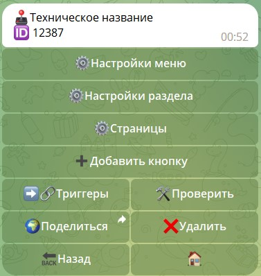
:::

## Настройки меню

Глобальные настройки меню и всех созданных подменю в этом меню.

::: details Интерфейс настроек
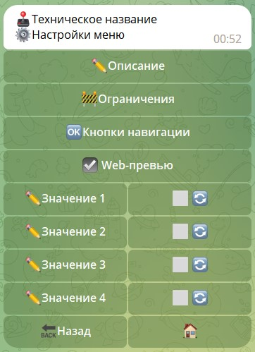
:::

### Описание

Настройки меню связанные с описанием меню.

| Функция                | Описание                                                                                                                                                                                                                                      |
|------------------------|-----------------------------------------------------------------------------------------------------------------------------------------------------------------------------------------------------------------------------------------------|
| **Тех название**       | название видимое для администратора.                                                                                                                                                                                                          |
| **Заголовок**          | указанный текст будет присутствовать на всех страницах меню, в верхней части сообщения.                                                                                                                                                       |
| **Текст по умолчанию** | Вы можете задать стандартный текст внутри кнопки. Это не текст на кнопке, но внутри неё - подобно тому, который Вы сейчас читаете. Если при создании кнопки Вы пропустите этот шаг, то текстом кнопки автоматически будет текст по умолчанию. |
| **Нижний колонтитул**  | указанный текст будет присутствовать на всех страницах меню, в нижней части сообщения.                                                                                                                                                        |

::: details Подробнее
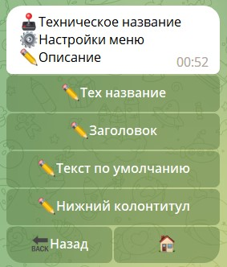
:::
### Ограничения

Настройки ограничений доступа меню пользователям.

* **Ограничения Открытия меню** — позволяет ограничить доступ к разделу меню. 
* **Ограничения Показа кнопка** — позволяет ограничить видимость кнопки меню.

::: details Подробнее
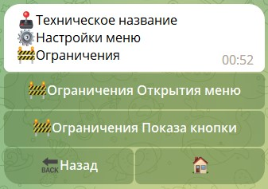
:::

::: tip ВАЖНО
Это глобальные ограничения, которые будут распространяться на все подразделы.
:::

### Кнопки навигации

Настройки отображения кнопок навигации

Кнопки навигации, для более удобного и быстрого перемещения пользователя в вашем меню.

|      Функция      | Описание                                                                  |
|:-----------------:|---------------------------------------------------------------------------|
|     💢Скрыть      | скрыть (удалить) открытое меню, по умолчанию значок: 💢                   |
|      🔙Назад      | позволяет переместить на страницу (раздел) назад, по умолчанию значок: 🔙 |
|      🏠Домой      | позволяет переместить в главное (корневое) меню, по умолчанию значок: 🏠  |
| ◻Кнопки столбиком | Публикация кнопок навигации не в ряд по умолчанию, а в столбик            |

::: details Подробнее
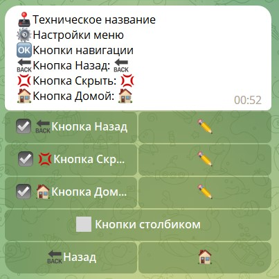
:::
### Web-превью

Отключает превью ссылок в разделе.

- Отключение превью в главном разделе — отключает превью во всех вложенных разделах.

- Отключение превью в подразделах — отключает превью только этого подраздела.


### Значения

Значения позволяют хранить цифровые параметры при отправке публикации меню в чат.


Получить доступ к этим значениям можно с помощью переменной ${buttonsVar.vN}, где N это число от 1 д 4.

Пример применения значений в меню:
* `${buttonsVar.v1}` — `${user.id}` — ID инициатора
* `${buttonsVar.v2}` — `${targetUser.id}` — ID реплай юзера
* `${buttonsVar.v3}` — `${chat.id}` — ID чата
* `${buttonsVar.v4}` — `${profile.name.value}` — Числовой параметр профиля 


::: tip ℹ️  Важно!
* По умолчанию, все значения хранятся только в рамках одного меню (одной публикации). Переход между страницами не сохраняет эти значения.
* Галочка 🔄 справа от значения, позволяет сохранить значения во всех подразделах меню.
* Важный момент! Все значения формируются до отправки или редактирования сообщения в чат.
:::

::: details Подробнее
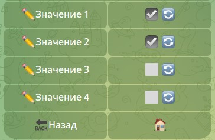
:::


## Настройки кнопки

Раздел практически полностью копирует интерфейс раздел [Настройки меню](/admin/menu/#настроики-меню) 
за исключением 2-х функций, которые будут подробно описаны ниже:

| Функция   | Описание                                                                                                                                                                        |
|-----------|---------------------------------------------------------------------------------------------------------------------------------------------------------------------------------|
| Скрыть    | Полное скрытие кнопки для всех пользователей бота без исключений                                                                                                                |
| Выключить | Определение статуса доступности кнопки. В связке с ограничением [isDisable](/ext/restrictions/#isdisable) позволяет определять, для кого кнопка будет работать, а для кого нет. |

## Настройки раздела

Раздел определяет настройки конкретного раздела.

| Функция                   | Описание                                                                                                                                                                                                                                                    |
|---------------------------|-------------------------------------------------------------------------------------------------------------------------------------------------------------------------------------------------------------------------------------------------------------|
| Импорт/Экспорт            | _(в разработке)._                                                                                                                                                                                                                                           |
| Ограничения открытия меню | Позволяет ограничить доступ к разделу меню по любому заданному вами условию. Например по наличию юзернейма у пользователя, с помощью ограничения "hasUsername✅"Это локальное ограничение, которое будет распространяться только на этот раздел (подраздел). |
| inline-запрос             | Позволяет настроить inline — запрос на вызов этого меню.                                                                                                                                                                                                    |
| Статистика                | Позволяет вести статистку по активности раздела. Пример ниже                                                                                                                                                                                                |
| Web-превью                | Отключает превью ссылок в разделе. Отключение превью в главном разделе - отключает везде. Отключение в подразделах - отключает только там.                                                                                                                  |
| Триггер -> Визуализация   | Важная функция! Подробное описание ниже.                                                                                                                                                                                                                    |
| Комментарии               | _(в разработке)._                                                                                                                                                                                                                                           |
| Кнопки навигации          | Управление видимостью кнопок навигации по меню в текущем разделе меню.                                                                                                                                                                                      |
| Динамическое меню         |                                                                                                                                                                                                                                                             |

::: details Подробнее
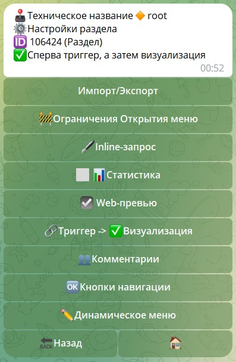

####  Триггер -> Визуализация

* Если вы используете реакции связанные с загрузкой данных, скриптами, или другими процессами, которые занимают время, то рекомендуется выбрать порядок: **Триггер -> Визуализация**

В таком случае, скорость публикации меню будет ниже, бот сначала загрузит все необходимые данные, выполнит скрипты, а уже потом отправит меню, в связи с чем, возможны задержки.

* Если же, у вас в меню вся информация статична, и не требуется подготовки перед отображением информации, то рекомендуется выбрать порядок: **Визуализация -> Триггер**

В таком случае скорость отклика будет быстрее, так как не будет происходить подготовки меню перед отправкой.

#### Статистика

::: details Подробнее
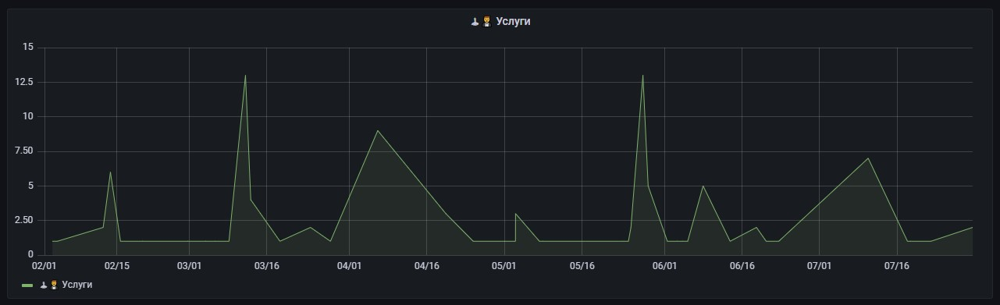
:::

## **Новая страница**

Доступны следующие типы страниц:

🖼 - **Создание страницы с медиа и текстом**

| Функция          | Описание                                                                                 |
|------------------|------------------------------------------------------------------------------------------|
| ✏️Текст          | отредактировать текст, в том числе и полностью удалить.                                  |
| ✏️Добавить текст | позволяет дополнить имеющийся текст, удалить его нельзя (удобная функция для админ меню) |
| 📎Файл           | Прикрепить медиа (лимит Telegram — 2 ГБ)                                                 |
| ✏️⬅️             | отредактировать название кнопки "назад", по умолчанию: ⬅️                                |
| ✏️➡️             | отредактировать название кнопки "вперед", по умолчанию: ➡️                               |

::: details Подробнее
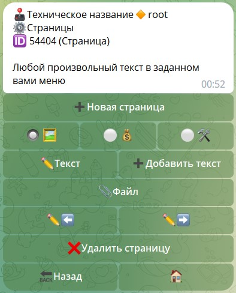
:::
💰 - **Создание страницы для оплаты**

Интерфейс этого раздела полностью связан с настройками раздела: **Платежи — платежные формы**. Перед настройкой этого раздела, вам необходимо настроить разделы:


::: tip ℹ️  Важно!
* На данный момент доступно для выбора только способы оплаты Telegram.
:::

::: details Подробнее
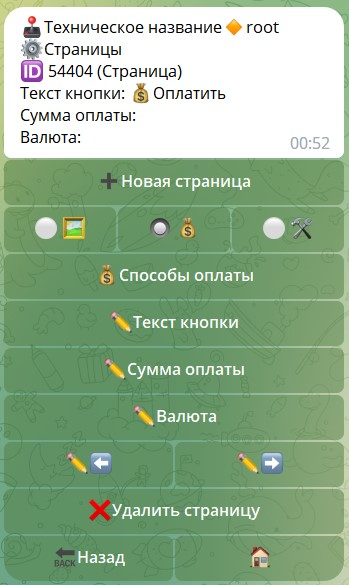
:::
## Добавить кнопку (типы кнопок)

::: details Подробнее

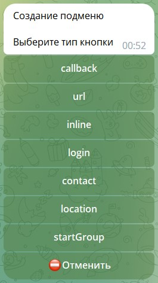

Типы кнопок:

| Тип            | Описание                                                                                              |
|----------------|-------------------------------------------------------------------------------------------------------|
| **callback**   | Вызов действия (отображения подраздела, или вызова триггеров)                                         |
| **url**        | Вставить ссылку для прямого открытия ресурса (не предусматривает использование реакций или счетчиков) |
| **inline**     | Позволяет настроить inline — запрос на вызов различного контента                                      |
| **login**      | Подробнее [по ссылке](https://core.telegram.org/widgets/login)                                        |
| **contact**    | Запросить у пользователя его контакт                                                                  |
| **location**   | Запросить у пользователя его геолокацию                                                               |
| **startGroup** | Добавление бота в чат пользователя                                                                    |
:::

::: tip Важно!
* Из-за особенностей Телеграма, кнопки: contact и location, работают исключительно в клавиатуре. Через обычное меню их вызвать нельзя ❗️❗️
:::
  ::: details Пример реализации кнопок
  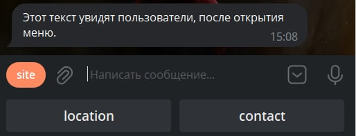
:::

Отслеживать ответы можно через глобальный триггер ДО или После, или обычными командами с помощью регулярных выражений. Пример того как это выглядит в логах:

**Локация**

::: details Подробнее

```json
{
  "service": "telegram",
  "type": "event",
  "data": {
    "update": {
      "update_id": 751626701,
      "message": {
        "message_id": 75857,
        "from": {
          "id": 255621638,
          "is_bot": false,
          "first_name": "name",
          "last_name": "name",
          "username": "username",
          "language_code": "ru",
          "is_premium": true
        },
        "chat": {
          "id": 255621638,
          "first_name": "name",
          "last_name": "name",
          "username": "username",
          "type": "private"
        },
        "date": 1690673447,
        "location": {
          "latitude": 11.111111,
          "longitude": 11.111111
        }
      }
    }
  }
}
```
:::

**Контакт**

::: details Подробнее

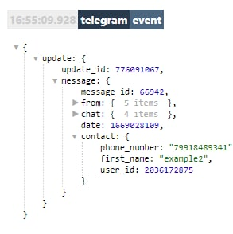

```json
{
  "service": "telegram",
  "type": "event",
  "data": {
    "update": {
      "update_id": 751626700,
      "message": {
        "message_id": 75856,
        "from": {
          "id": 255621638,
          "is_bot": false,
          "first_name": "name",
          "last_name": "name",
          "username": "username",
          "language_code": "ru",
          "is_premium": true
        },
        "chat": {
          "id": 255621638,
          "first_name": "name",
          "last_name": "name",
          "username": "username",
          "type": "private"
        },
        "date": 1690673048,
        "contact": {
          "phone_number": "+7911111111",
          "first_name": "name",
          "user_id": 500000000
        }
      }
    }
  }
}
```
:::

### Триггеры

### Триггер Раздела

Срабатывает при любом действии

### Триггер До

Срабатывает перед отображением меню

### Триггер После

Срабатывает после совершения любого действия

### Триггер Назад

Срабатывает при нажатии на кнопку Назад

Порядок действий других триггеров при нажатии на кнопку callback:
* Триггер Назад
* Триггер До
* Триггер Раздела
* Триггер После

### Триггер Скрыть

Срабатывает при нажатии на кнопку Скрыть

Порядок действий других триггеров при нажатии на кнопку callback:
* Триггер Скрыть

### Триггер Домой

Срабатывает при нажатии на кнопку Домой

Порядок действий других триггеров при нажатии на кнопку callback:
* Триггер Домой
* Триггер До
* Триггер Раздела
* Триггер После

## Динамическое меню

Динамическое меню - это меню, которое может подстраивать в процессе работы. Т.е. вы не создаете заранее кнопки, которые будут отображаться в этом разделе меню. Вы с помощью переменной указываете в Триггере Раздела какие кнопки должны быть в этом разделе. Откройте настройки раздела и нажмите на кнопку ✏️Динамическое меню, в ответ бот попросит написать путь до переменной, напишите например `${localVar.menuData}`. Теперь в Триггер Раздела, создайте локальную переменную `menuData` следующего содержания:

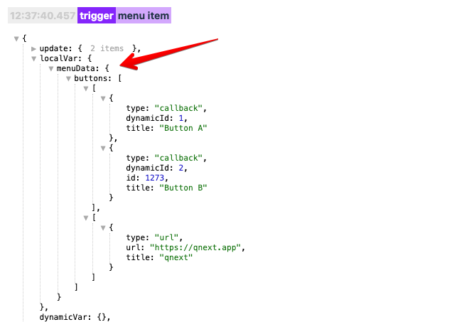

Получить такой объект можно например с помощью **JSON** строки:
```json 
{
 "buttons": [[{
    "type": "callback",
    "dynamicId": 1,
    "title": "Button A"
   }, {
    "type": "callback",
    "dynamicId": 2,
    "id": 1273,
    "title": "Button B"
   }], [{
    "type": "url",
    "url": "https://qnext.app",
    "title": "qnext"
   }]
  ]
}
```

Валидировать и посмотреть JSON строку можно на сайте [https://jsonformatter.org/json-viewer](https://jsonformatter.org/json-viewer).

Или с помощью **YAML** строки:
```yaml 
buttons:
  - 
    - type: callback
      dynamicId: 1
      title: Button A
    - type: callback
      dynamicId: 2
      title: Button B
  - 
    - type: url
      title: open url
      url: https://qnext.app
```

Валидировать и посмотреть YAML строку можно на сайте [https://jsonformatter.org/yaml-viewer](https://jsonformatter.org/yaml-viewer).

Объект menuData может содержать следующие параметры:
* **buttons** - массив массивов кнопок.
* **openItemId** - id раздела который необходимо открыть. Чтобы открыть базовый раздел, укажите строку root.
* **openPageId** - id страницы, которую надо открыть, если был передан параметр openItemId. Если не указать - тогда откроется первая страница.
* **breakUpdate** - не показывать текущее меню, т.е. после выполнения, обновления раздела меню не произойдет.

Массив кнопок `buttons`, должен содержать объекты button с полями `title` и `type`. Поле type может принимать одно из значений:
* callback
* url
* inline
* login
* contact
* location

В зависимости от поля type должны так же присутствовать и другие поля.

### type: callback

В этом случае необходимо дополнительно передать следующие параметры:
* dynamicId - любой числовой идентификатор, задача которого - определить кнопку, нажатую пользователем. ⚠️Обязательно должен быть числом.
* id - здесь может быть ID раздела меню, который необходимо открыть, это может быть любой раздел текущего меню. Необязательный параметр, если не передать, откроется текущий раздел меню. ⚠️Обязательно должен быть числом.
* `buttonValue1, buttonValue2, buttonValue3, buttonValue4`: здесь можно передать 4 любых значений, которые будут вести себя как `кастомные Значения` в настройках меню. ⚠️Обязательно должен быть числом.

::: details Подробнее
```json
{
  "type": "callback",
  "title": "callback-кнопка",
  "dynamicId": 123,
  "id": 321,
  "buttonValue1": 100,
  "buttonValue2": 200
}
```
:::

После нажатия на такую кнопку, параметр `dynamicId` будет доступен в триггере раздела в переменной `${body.dynamicId}`.

### type: url

В этом случае необходимо передать параметры:
* url - ссылка, которую пользователь откроет при нажатии на кнопку

::: details Подробнее
```json
{
  "type": "url",
  "title": "url-кнопка",
  "url": "https://qnext.app/docs"
}
```
:::

### type: inline
Кнопка, которая запускает inline режим бота:
* query - строка, которая будет подставлена в поле ввода после открытия inline меню
* currentChat - открывать inline меню в текущем чате. Необходимо указать boolean значение. Необязательное значение.

::: details Подробнее
```json
{
  "type": "inline",
  "title": "inline-кнопка",
  "query": "строка для поиска",
  "currentChat": true
}
```
:::

### type: login
В этом случае необходимо передать параметры:
* url - ссылка, на которую будет отправлена авторизационная информация

::: details Подробнее
```json
{
  "type": "login",
  "title": "login-кнопка",
  "url": "https://my-domen.com"
}
```
:::

### type: contact
Кнопка, которая запросит у пользователя его контакты. Только для клавиатуры. У этой кнопки нет дополнительных параметров.

::: details Подробнее
```json
{
  "type": "contact",
  "title": "Контакты"
}
```
:::

### type: location
Кнопка, которая запросит у пользователя гео локацию. Только для клавиатуры. У этой кнопки нет дополнительных параметров.

::: details Подробнее
```json
{
  "type": "location",
  "title": "Геолокация"
}
```
:::

### type: startGroup
Кнопка, открывающая окно выбора чата, в который будет автоматически добавлен бот.
* url - строка, которая будет передана платформе в момент добавления бота в чат

::: details Подробнее
```json
{
  "type": "startGroup",
  "title": "Добавить в чат",
  "url": "add_chat" 
}
```
:::
