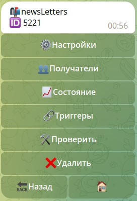
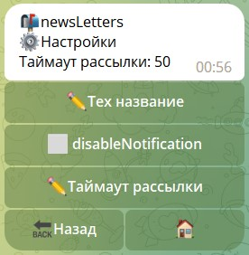
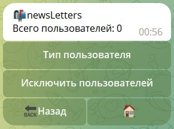
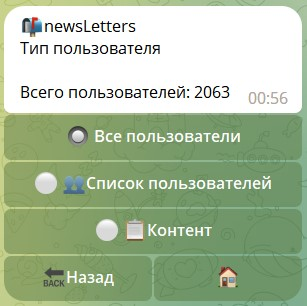
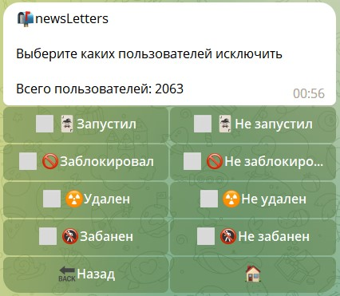
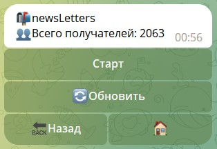
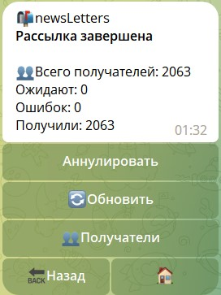
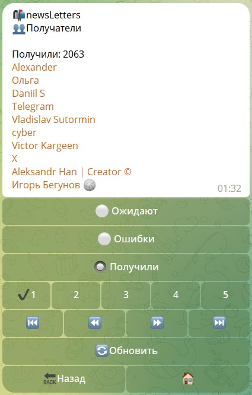
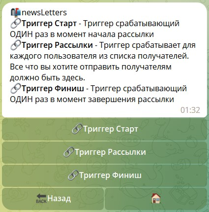

# Рассылка

**Рассылка** - модуль, позволяющий работать со всеми пользователями бота и чатами. 

[Реакции для работы с рассылками](/admin/newsletters/reaction/)

А именно:
* Работа с пользователями бота
* Работа с профилями пользователей
* Отправка сообщений пользователям


Например, можно разослать всем пользователям сообщение, с помощью реакции **[sendMessage](/admin/other/reactions/sendmessage/)** 
или любую другую сущность, которую можно отправить, с помощью соответствующих реакций 
типа **Send**: **[sendMenu](/admin/other/reactions/sendmenu/), [sendContent](/admin/other/reactions/sendcontent/)**

#### Интерфейс рассылки

| Раздел                                       | Описание                                                                                      |
|----------------------------------------------|-----------------------------------------------------------------------------------------------|
| [Настройки](/admin/newsletters/#настроики)   | Настройка главных параметров рассылки                                                         |
| [Получатели](/admin/newsletters/#получатели) | Гибкая настройка получателей                                                                  |
| [Состояние](/admin/newsletters/#состояние) | Отображение статуса рассылки                                                                  |
| [Триггеры](/admin/newsletters/#триггеры) | Главный раздел рассылки. Здесь задаются реакции, которые будут выполняться во время рассылки. |
| Проверить                                    | Функция запускает полноценную рассылку по отношению к инициатору нажатия на кнопку            |
| Удалить                                      | Полное и безвозвратное удаление рассылки.                                                     |

::: details Подробнее



:::


## Настройки

Настройки рассылки, определяющий глобально поведение рассылки.

| функция             | Описание                                                                              |
|---------------------|---------------------------------------------------------------------------------------|
| Тех. название       | Техническое название которое видно только админам                                     |
| DisableNotification | Выключение уведомлений при отправке сообщений                                         |
| Таймаут рассылки    | Время в милисекундах между отправкой сообщений во время рассылки. (min 50 - max 5000) |

::: details Подробнее



:::

## Получатели

Раздел отвечающий за гибкую настройку списка пользователей, с которыми буде работать рассылка.

| Раздел                                                                  | Описание                                                |
|-------------------------------------------------------------------------|---------------------------------------------------------|
| [Тип пользователей](/admin/newsletters/#тип-пользователеи)              | Раздел позволяет выбрать тип пользователей для рассылки |
| [Исключить пользователей](/admin/newsletters/#исключение-пользователеи) | Раздел позволяет исключить пользователей по условию     |

::: details Подробнее



:::

#### Тип пользователей

Позволяет выбрать тип пользователей, которым придет рассылка.

| Функция              | Описание                                                                                                    |
|----------------------|-------------------------------------------------------------------------------------------------------------|
| Все пользователи     | Выбрать всех пользователей бота                                                                             |
| Списки пользователей | Определенный список пользователей. Списки создаются в разделе [люди - списки пользователей](/admin/people/#списки-пользователеи) |
| Контент              | Проголосовавших в голосовании (с помощью [контента](/admin/content/) и реакции [vote](/admin/vote/vote/))   |

::: details Подробнее



:::

#### Исключение пользователей

Позволяет исключить из рассылки категории пользователей бота.

|       Тип       | Описание                                                                                                           |
|:---------------:|--------------------------------------------------------------------------------------------------------------------|
|    Запустил     | Пользователь запустил бота                                                                                         |
|   Не Запустил   | Пользователь не запускал бота (бот видел пользователя в чате или канале)                                           |
|  Заблокировал   | Пользователь заблокировал бота                                                                                     |
| Не Заблокировал | У пользователя запущен диалог с ботом                                                                              |
|     Удален      | Аккаунт пользователя удален                                                                                        |
|    Не Удален    | Аккаунт пользователя не удален                                                                                     |
|     Забанен     | Пользователь забанен в боте в ручном режиме или с помощью реакции [banBotUser](/admin/other/reactions/banbotuser/) |
|   Не Забанен    | Пользователь не забанен в боте                                                                                     |

#### **Рекомендуемые настройки для быстрой рассылки:**

* Пользователь НЕ запускал бота в привате
* Пользователь заблокировал бота
* Аккаунт пользователя удален
* Пользователь забанен в боте

::: details Подробнее



:::

## Состояние

Раздел отвечает за отображение статуса рассылки и состоит 3-х интерфейсов:

#### Интерфейс по умолчанию:

Отображает число получателей рассылки и предлагает запустить рассылку.

::: details Подробнее



:::

#### Интерфейс во время рассылки:

Отображает прогресс рассылки, а так же, предоставляет возможность прервать рассылку, и посмотреть подробности рассылки.

::: details Подробнее


:::

#### Состояние после рассылки:

Отображает результаты рассылки. 

::: details Подробнее

  

:::

## Триггеры

Триггеры в рассылке - самый важный раздел. Именно здесь задаются реакции которые будут выполнены во время работы рассылки. 

| Триггер          | Описание                                                                                                                                                                                                                      |
|------------------|-------------------------------------------------------------------------------------------------------------------------------------------------------------------------------------------------------------------------------|
| Триггер старт    | Триггер срабатывающий ОДИН раз в момент начала рассылки. Подходит например для оповещения администраторов о запуске рассылки, или для формирования данных которые будут статистичны при рассылке. Позволяет сэкономить время. |
| Триггер Рассылки | Триггер срабатывает для каждого пользователя из списка получателей. Все что вы хотите отправить получателям должно быть здесь.                                                                                                |
| Триггер Финиш    | Триггер срабатывающий ОДИН раз в момент завершения рассылки. Подходит например для оповещения администраторов об успешной рассылке.                                                                                           |

::: details Подробнее



:::

В триггере финиша доступны переменные для вывода результатов рассылки:

::: details Подробнее

| Переменная                 | Описание                                        |
|----------------------------|-------------------------------------------------|
| ```${stats.errors}```      | Количество ошибок                               |
| ```${stats.userBlocked}``` | Количество людей заблокировавшие бота           |
| ```${stats.userDeleted}``` | Количество удалённых аккаунтов                  |
| ```${stats.userNoStart}``` | Количество людей, не запустивших бота в привате |
| ```${stats.complete}```    | Количество людей получивших рассылку            |
:::

::: tip Полезно
* Рассылка выполняется методом итерации. Берется пользователь 1, к нему выполняются все реакции. Берется пользователь 2, к нему выполняются все реакции, и так до конца списка.
* В рассылке данные о пользователе будут находиться в переменной `${targetUser}`
* Переменные созданные в триггере старта остаются доступны в триггере рассылки и триггере финиша, а не обнуляются по завершению триггера
:::

Результат рассылки в триггере финиша, если добавить реакцию [log](/admin/other/reactions/log/):


### Таймаут рассылки

#### Что такое таймаут рассылки?

Чтобы понять что такое таймаут рассылки, необходимо понять как работают рассылки на платформе QNext. В момент старта рассылки, сначала запускается 🔗Триггер Рассылки **для первого** пользователя. Все реакции в этом триггере выполняются по очереди. Как только будут выполнены все реакции, будет запущен 🔗Триггер Рассылки **для следующего** пользователя... и так для всех пользователей по очереди из источника указанного в рассылке. Так вот временная пауза между Триггерами Рассылки для разных пользователей называется **таймаутом рассылки**.
::: tip ℹ️
Например если вы отправляете рассылку по списку пользователей - тогда первым будет обработан тот, кто раньше был добавлен в этот список. В целях оптимизации в будущем бот может изменить порядок, поэтому не стоит закладывать на это какую то логику.
:::
#### Для чего нужен таймаут?

В [документации telegram](https://core.telegram.org/bots/faq#broadcasting-to-users), в разделе ```My bot is hitting limits, how do I avoid this?``` сказано следующее:
* При отправке сообщений в 1 чат, нельзя делать более 1 сообщения в секунду.
* При отправке сообщений в разные чаты(разным людям), нельзя делать более 30 запросов в секунду.
* Также нельзя делать в группу более 20 сообщений в минуту.

Телеграм в принципе разрешает иногда короткие всплески и выход за пределы этих лимитов, но если вы будете злоупотреблять этим, в какой то момент на запросы вашего бота telegram будет отвечать ошибкой: `429 Too Many Requests: retry after XXX`, где XXX - это количество секунд. И ваш бот не сможет ничего отправлять в течении указанного в ошибке времени.
#### Как мне избежать блокировки от telegram?

Чтобы не получить блокировку, необходимо в рассылке указать таймаут - это количество миллисекунд, сколько бот будет простаивать, перед тем как начать выполнять 🔗Триггер рассылки для следующего пользователя. Рассмотрим пример: Необходимо в рассылке отправить каждому пользователю 2 текста и следом меню. В этом случае ваш 🔗Триггер рассылки может выглядеть так:
* ⚡️message 
* ⚡️message 
* ⚡️sendMenu

Итак, мы имеем три реакции, которые отправляют что-то пользователю в личку. У телеграмм есть ограничение не более 30 сообщений в секунду. Это значит что мы должны обрабатывать максимум 10 пользователей в секунду. Почему 10? - у нас 3 реакции на 1 пользователя, значит 10 пользователей в секунду генерируют 30 запросов. Лучше не играть с огнем, и обрабатывать не 10 пользователей в секунду, а чуть по меньше, например 8. Таймаут измеряется в миллисекундах (в 1 секунде - 1000 миллисекунд). Это значит что таймаут должен быть таким: 
```plain 
1000 миллисекунд / 8 пользователей = 125 миллисекунд
```

В настройках рассылки указываем таймаут **125**.


#### А что если рассылка ничего не отправляет пользователям?

Если ваша рассылка не отправляет ничего пользователю, например вы хотите что-то записать в профиль пользователям, тогда таймаут рассылки не нужен, лучше его убрать, чтобы рассылка обработалась как можно быстрее. Но, в любом случае в платформе есть минимальный таймаут 50 миллисекунд. Минимальный таймаут действует всегда для любых рассылок. 
