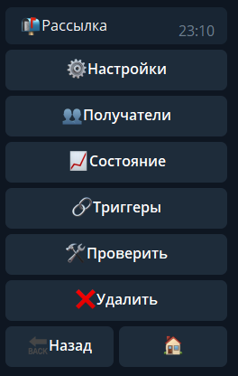
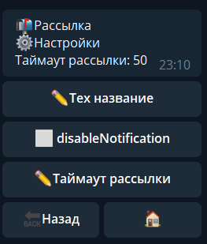
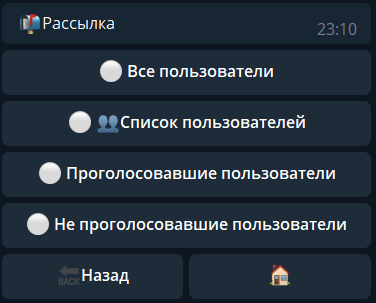
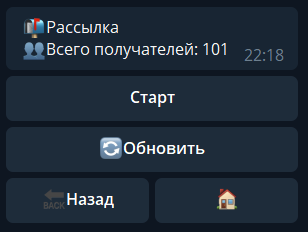
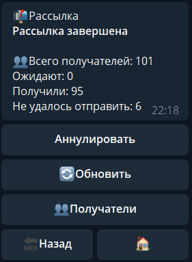
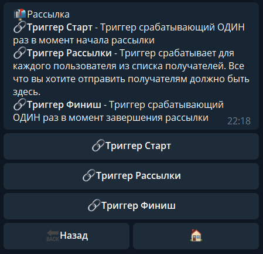

Рассылки - универсальная сущность, позволяющая работать со всем: отправка сообщений пользователям, отправка контента в чаты, проверка и изменение параметров профиля или статуса пользователя и так далее.

Например,  можно разослать всем пользователям сообщение, с помощью реакции **sendMessage,** или любую другую сущность (меню, контент), которую можно отправить, с помощью соответствующих реакций **sendMenu, sendContent.**

Рассылка предлагает для настройки следующие параметры:

В настройках рассылки существуют следующие разделы, каждый из которых отвечает за свои задачи:

Настройки:

* указать/изменить название рассылки
* Включить/выключить уведомления
* Настроить таймаут рассылки, время исчисляется в милисекундах (min 50 - max 5000)

* Выбрать всех пользователей бота
* Определенный список пользователей (списки создаются в разделе: люди - списки пользователей)
* Проголосовавших в голосовании (с помощью контента и реакции vote)
* Не проголосовавших в голосовании (с помощью контента и реакции vote)

Раздел состоит из состояний:

Такое состояние видим когда рассылка не была запущена (или аннулирована)

Такое состояние видим когда рассылка успешно завершена.

Самый важный (и основной раздел) в рассылке.

* Триггер старта — Триггер срабатывающий ОДИН раз в момент начала рассылки

* Триггер рассылки — Триггер срабатывает для каждого пользователя из списка получателей. Все что вы хотите отправить получателям должно быть здесь.

* Триггер финиша — Триггер срабатывающий ОДИН раз в момент завершения рассылки

В этом триггере доступны переменные для вывода результатов рассылки:

${stats.errors} - Количество ошибок

${stats.userBlocked} - Количество людей заблокировавшие бота

${stats.userDeleted} - Количество удалённых аккаунтов

${stats.userNoStart} - Количество людей, не запустивших бота в привате

${stats.complete} - Количество людей получивших рассылку
