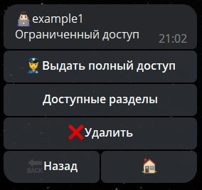
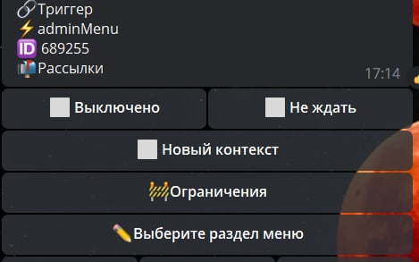

# adminMenu

**adminMenu** - вы сможете настроить своё меню администратора. Полезно если например вы не используете часто все разделы из главного /main меню. Вы можете сделать несколько админ панелей(клавиатур) и работать с той, которая актуальна в данный момент.

Связано с ограничением [isAdmin](/docs/ext/restrictions), можно использовать, чтобы показать меню только админу, а остальным показать message с пояснением что это доступно только админам.

Для настройки админменю вам потребуется выполнить 2 действия:

```plain
Люди — администраторы — выбрать администратора — доступные разделы - указать разделы к которым будет доступ у конкретного админа
```

 

```plain
adminMenu - выбрать раздел меню
```

 


