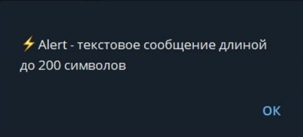

# alert

**alert** - Текст во всплывающем окне с подтверждением
 

::: tip  Особенности
* Лимит символов - 200
* Вызывается только при нажатии на кнопку
* Нельзя вызвать с помощью Телеграм клавиатуры
* Может содержать макросы и переменные, но не ссылки
* Не поддерживает любое форматирование 
* Если установить 2 alert в реакции, сработает только первый
::: 

[Попробовать](https://t.me/QNextSupportBot?start=cmd_MDFNTjJ8SUk3NHxDTWJ1bQ)

[bot.api method - answerCallbackQuery](https://core.telegram.org/bots/api#answercallbackquery)