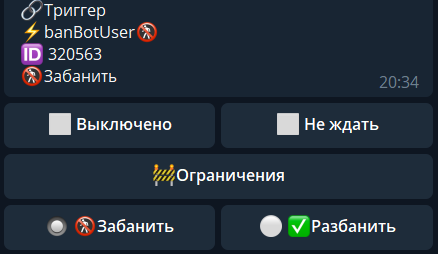

# banBotUser

**banBotUser** - позволяет заблокировать пользователя в боте.

Пока пользователь забанен - бот не будет реагировать на его действия, и не отзываться на команды пользователя.

::: tip  Особенности

* Нельзя применить по отношению к создателю бота и к самому боту

:::

